#
## Lab 0 - Getting Set Up for Local Development

## Intro

This guide is intended to help you get set up with working on CS123 projects locally. If you have any questions or run into any issues, please let us know (during the designated local dev. Zoom session, email, or Piazza) and we&#39;ll do our best to help you. The guide is long and detailed, but that&#39;s to help you. In the extreme case, the time you spend doing stuff might be 30 minutes, with the waiting time (esp. waiting for Github to do things) might be a few hours. In general, it&#39;ll be far less.

A quick overview of the tools/software you will need for computer graphics this semester:

- QtCreator
- Git
- Github Classroom
- Gradescope

**Note:** Overall Qt/QtCreator and Glew (a library that makes it a lot easier to use OpenGL) will suck up 3GB of space, approximately. Additional images or scenefiles can also take up a fair bit of space. Be sure you have room. If necessary, we may be able to help you save 1GB of space by installing an older version of Qt.

## Before You Start

Make sure you&#39;ve completed our [Getting Started](https://forms.gle/A1WaW3BsNjto3Psh7) form. This will ensure you&#39;ve set up both a GitHub account and a Gradescope account. You should also have joined the Gradescope course and Piazza.

**Stop here until you&#39;ve completed the Getting Started form**.

##
##
## Installing Qt/QtCreator

Installing Qt is now optional (but still recommended) if you wish to use FastX as department machines have Qt pre-installed.

## **MacOS**

1. Check that you are on MacOS Catalina (should be the case in 99% of Macs).
2. Install the latest version of Xcode 11.7 from the App store (about 25 minutes) or update it if you already have some version of Xcode installed.
3. Make sure xcode-select points to the right place by running in a terminal:
sudo xcode-select -s /Applications/Xcode.app/Contents/Developer
4. Install Qt (15-25 min). If you already have some other version, uninstall it first!

    a. [https://www.qt.io/download-qt-installer](https://www.qt.io/download-qt-installer) (2.6GB)

    b. Right-click &quot;Open&quot; or double-click on the downloaded file to show a DMG file 
    

    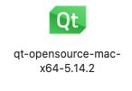
    <p\>  [~5 mins] 

    c. Double-click on that.

    d. Follow the instructions on the installer to create a Qt account, etc.

    e. When selecting components, you need Qt (e.g. Qt 5.14.2), but you don&#39;t need ALL of it. Tick just macOS. Also tick &quot;Developer and Designer Tools&quot;. 
    
    

    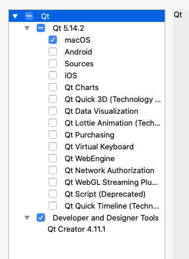
    <p\>   

5. Continue and finish the installation process.
6. We&#39;ll provide an example on how to open, configure and run a Qt project later on in this guide.

## **Windows**

1. Install Qt (takes about 15-25 min)

    a. [https://www.qt.io/download-qt-installer) (2.3GB)

    b. Open when done downloading
2. Follow instructions on the installer to create a new Qt account if you do not have one
3. When selecting components:
    a. Under &quot;Qt&quot;, you&#39;ll need Qt 5.14.2, and you&#39;ll also need to select MinGW 7.3.0 32-bit or MinGW 7.3.0 64-bit depending on what machine you use. MinGW is what provides the GCC compiler you&#39;ll need to compile your C++ code.

    Your selection should look like this:

    

    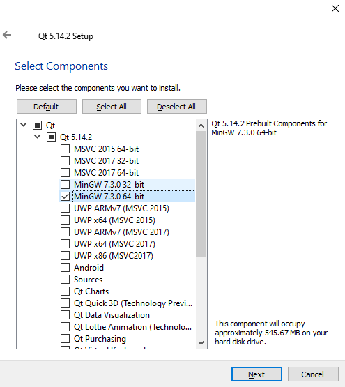
    <p\> 

    b. Under &quot;Tools&quot;, QtCreator 4.11.1 is already selected and is not optional. You should also select &quot;QtCreator 4.11.1 CDB Debugger&quot; under &quot;Tools&quot;.

    

    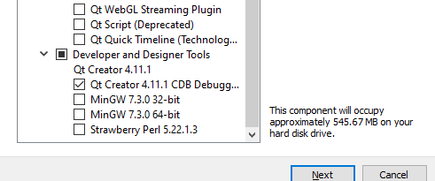
    <p\>

1. Continue and finish the installation process.
2. We&#39;ll provide an example on how to open, configure and run a Qt project later on in this guide. 

##

## **Linux**

1. Install Qt (about 15-25 min)

    a. [https://www.qt.io/download-qt-installer)

    b. This assumes you are using a 64-bit machine. If you are on a 32-bit machine (you can run the Linux command arch in a terminal to check), let us know and we&#39;ll direct you to an older version of Qt that supports this.

    c. Run chmod a+x qt-opensource-linux-x64-5.1.4.2.run if it is not an executable yet.

    d. Run the downloaded file

2. Follow the instructions to create a Qt account if you do not already have one.
3. When selecting components, you need Qt (e.g. Qt 5.14.2), but you don&#39;t need ALL of it. Tick just Desktop gcc 64-bit and tick &quot;Developer and Designer Tools&quot;. 
    

    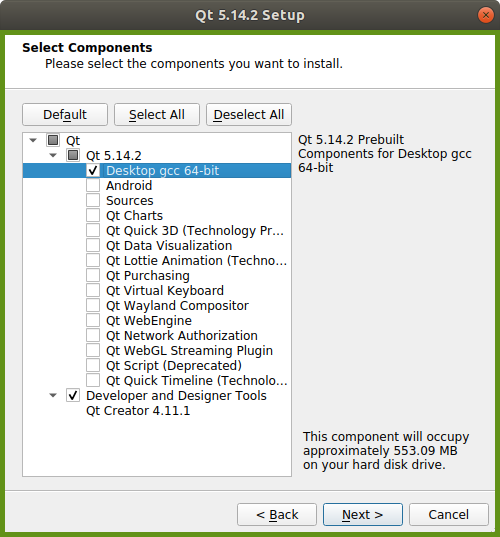
    <p\>
4. Continue and finish the installation process.
5. If you are on Ubuntu or other Debian-based Linux systems, run sudo apt-get install build-essential libgl1-mesa-dev to install minimum development tools, such as the GNU gcc compiler and _make_ program, and OpenGL
6. We&#39;ll provide an example on how to open, configure and run a Qt project later on in this guide.

##
## Setting Up Github Classroom

This semester, you will also be using Github Classroom for obtaining the project and lab source code and Gradescope to hand in assignments. All the project source code (Brush, Shapes, Filter, Sceneview, Intersect, and Ray) belong within the same repository and in some cases, build upon each other, so we highly recommend you take advantage of Git for version control.

## **Getting the Starter Code**

1. Access the stencil code for our projects [here](https://classroom.github.com/a/jGhMdNNB). You&#39;ll see a screen like this if you haven&#39;t used GitHub Classroom before. Click **Authorize github**.
    

    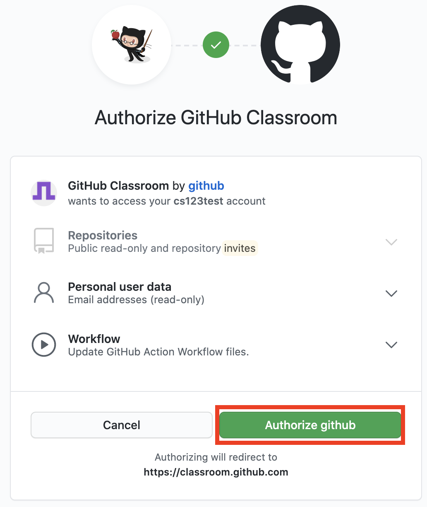
    <p\>
2. Accept the assignment on the next page by clicking **Accept this assignment**. 
    

    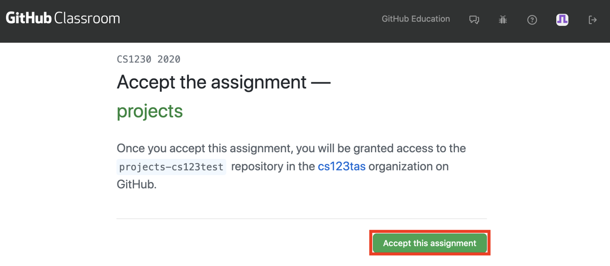
    <p\>
3. Wait for the starter code to load. This may take a while; if it does, that is expected! Contact an HTA if it takes more than 2 hours for your starter code to load.
    

    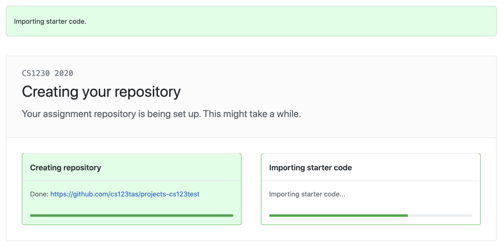
    <p\>
4. Your projects repository will now be set up! Click the repository link to prepare for the next section. 
    

    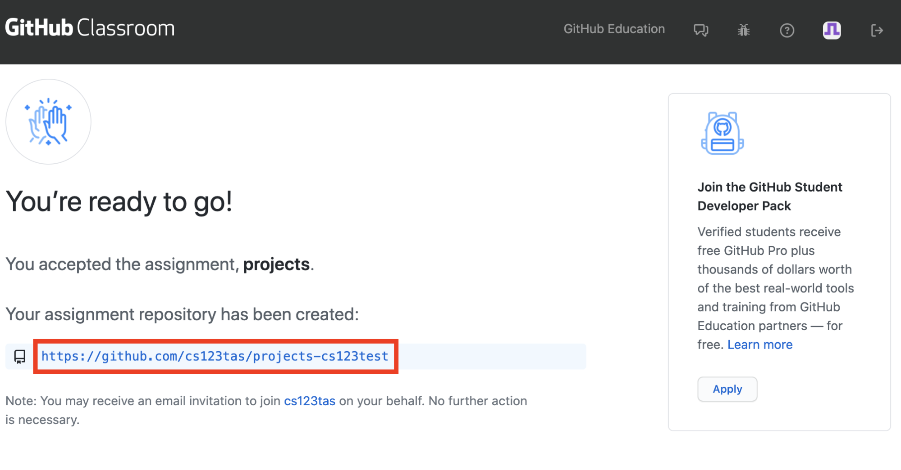
    <p\>

    

    
    <p\>

## **Working with the Code Locally**

1. Copy the repository link from the repository page by clicking on **Code** and then the **clipboard icon**.

    

    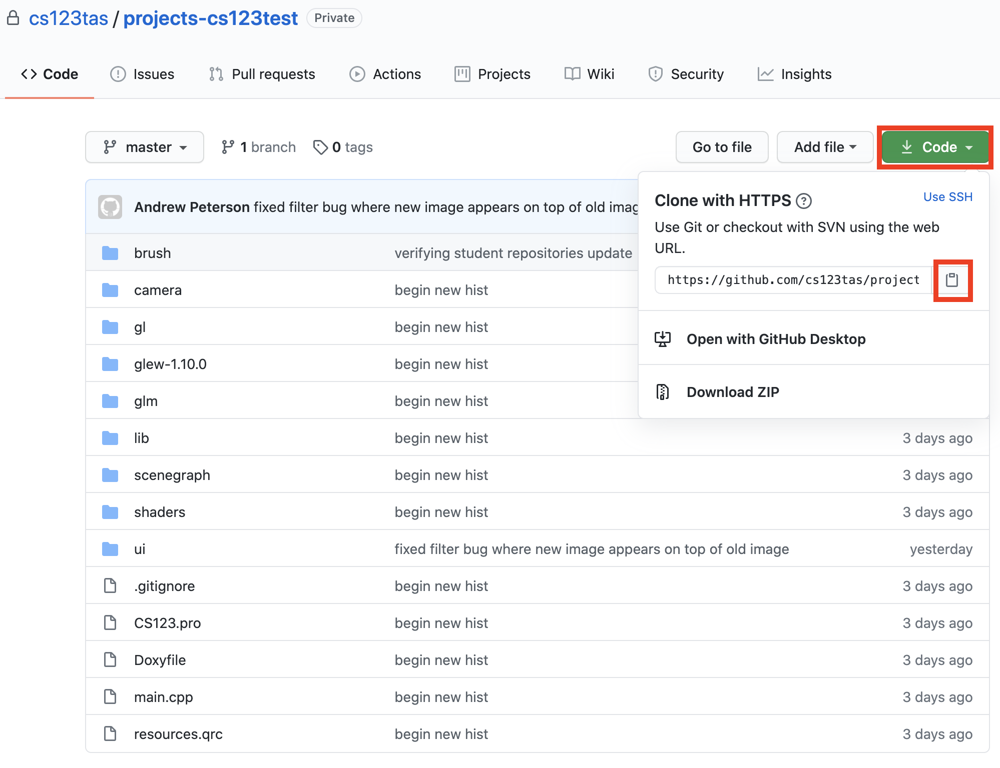
    <p\>

2. Make sure you have **git** installed locally on your computer. Follow [this guide](https://github.com/git-guides/install-git) if you do not already have **git** installed locally on your computer. 
3. Navigate to your terminal of choice (for Windows, this is likely to be **Git Bash** or **PowerShell** ; for macOS, **Terminal** ; for Linux, it depends on your distro but likely **bash** or **zsh** ).
4. Set up your local course directory structure if you have not already. You will want to have a directory at **~/course/cs1230**. You can create this directory using **mkdir -p ~/course/cs1230**.
5. Navigate to **~/course/cs1230** using **cd**.
6. Clone your repository using **git clone \&lt;pasted link\&gt;**.

    

    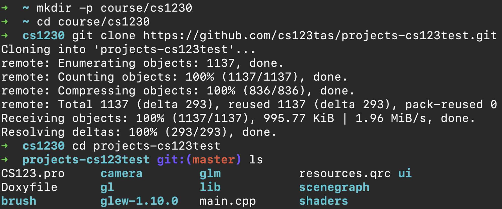
    <p\>

7. Navigate to your newly cloned repository in your terminal using **cd**. 
8. Run **git remote add upstream** [**https://github.com/cs123tas/projects.git**](https://github.com/cs123tas/projects.git).This command will allow you to pull new TA changes to the source code if we figure out a piece of code is broken or needs to be added.
9. Verify your remote repository settings with **git remote -v**.You should see four links, two labeled **origin** corresponding to the link you copied earlier and two labeled **upstream** corresponding to the command above.

    

    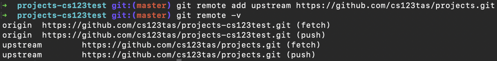
    <p\>

10. You&#39;re now ready to open the source code using QtCreator!

**Note:** We know not everyone is familiar with using Git especially with Github Classroom. The doc titled &quot;Tracking and Pushing Changes&quot; along with our Github guide (kindly borrowed and adapted from CS1430) will be very helpful in this case. If you are still confused after reading it please reach out to us, again through email, Piazza, Zoom and we will gladly help.

  

  
  <p\>

##
## Getting the Labs Starter Code

The labs starter code isn&#39;t part of Github Classroom as you won&#39;t be submitting it through Gradescope; you&#39;ll get them checked off either during lab hours (M 2-4pm, Th 7-9 pm) or any TA hours. After obtaining the labs starter code we&#39;ll walk you through QtCreator using Lab 0. You can get the labs starter code by opening up a terminal, cd-ing into your cs1230 folder (not your project-\&lt;github user\&gt; folder!) and running:

git clone https://github.com/cs123tas/labs.git

##

<p\>

##
## Working with QtCreator

Working in QtCreator can feel like using a standard text editor or IDE most of the time. However, QtCreator is known to be finicky at times and comes with its some unique quirks/features. We&#39;ll be using Lab 0 to walk you through the initial steps and verify that everything works properly on your machine.

## **Opening an existing Qt project**

Open Lab 0 by double-clicking on the **lab0.pro** file or navigating to QtCreator and from **File** -\&gt; **Open File or Project** , open **lab0.pro** file. The contents in a **.pro** file are similar to those of a Makefile in C and includes all the files required to build the project.

  

  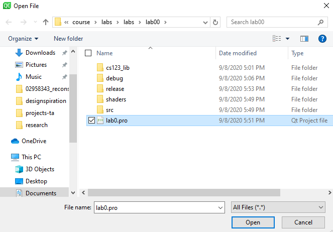
  <p\>

## **Configuring a Qt project**

After opening Lab 0, you will be shown this window below (the current example is what Windows users will see). Select at least &quot;Debug&quot; and &quot;Release&quot; and click &quot;Configure Project&quot;. This will create a **.pro.user** file in your project directory which saves the current configuration you have for a project.

  

  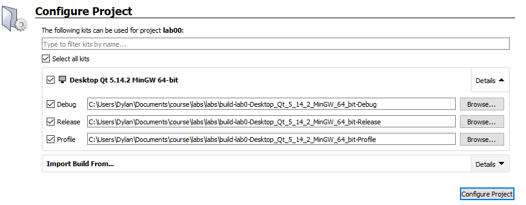
  <p\>

If you need to configure a project manually (which is unlikely for Mac and Windows users), go to Projects on the left toolbar and select Manage Kits. This allows you to change the version of Qt (although you should try to avoid having multiple!) and select the compiler you would like to use. If you are on a Linux machine this step may be necessary so that the project you&#39;re working on is configured with the correct GCC compiler.

In the past, we have had problems with configurations causing lots of weird errors. If this happens to you, check the Piazza local dev. FAQ and don&#39;t hesitate to post on Piazza. Usually this was caused by multiple versions of Qt existing on department machines or multiple **.pro.user** files being created so we expect this to happen less frequently now that everyone is developing on a home machine. 

## **Navigation and Adding New Files**

At this point you should be able to view and edit files within Lab 0. Some things to note, QtCreator defaults to &quot;project view &quot;, which organizes all your C++ source files and header files under either &quot;Sources&quot; or &quot;Headers&quot; respectively. It&#39;ll look like this image on the right. You can change this to &quot;filesystem view&quot; if this layout is confusing.

 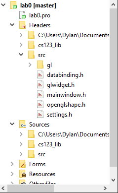
 <p\>

QtCreator, like most IDEs, also offers a fair amount of hotkeys and shortcuts. The most useful one we recommend especially starting out is ctrl-click on functions, classes, or variables to see where they are defined.

You don&#39;t need to do this now but it will be useful once you start having more autonomy over your project code structure. As mentioned above, the **.pro** file contains all the files needed to build your project. This means if you add a new file manually, you will need to also manually update the **.pro** file. Luckily Qt can do this for you. To do so, right-click on a folder, click &quot;Add New&quot; and create a new C++ Class. This will automatically update the **.pro** file correctly.

 

 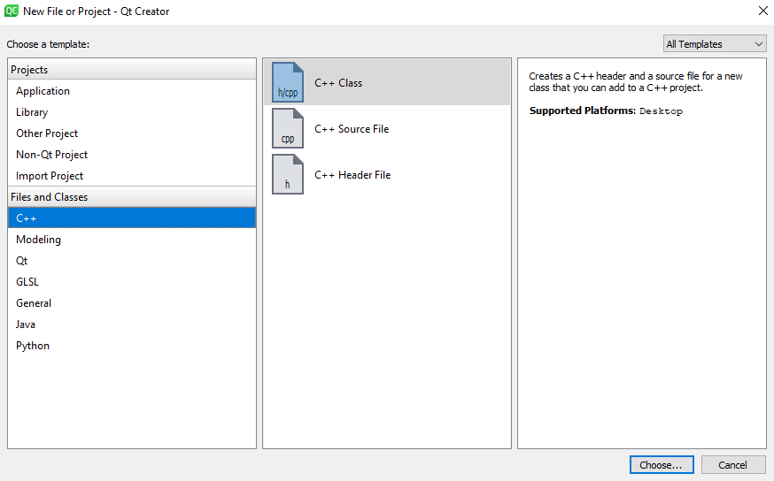
 <p\>

## **Building and Running Your Code**

Before compiling, we recommend navigating to &quot;Projects&quot; on the left toolbar and unticking Shadow build.

 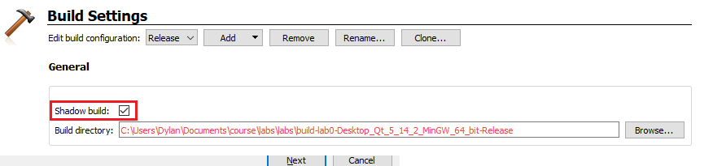
 <p\>

Click the Run button. A window should pop up that looks like this. If you&#39;re able to toggle between the three colors and watch the color change, that means you did everything correctly! Follow the same steps above except with the CS123 starter code. If you are running into errors, post or check on Piazza.

 Also, if another student helped you out getting set up, let us know by filling out the form [here](https://forms.gle/rMKvnvCjXLjtZofGA)! We&#39;d like to encourage participation / collaboration in some way this semester.

 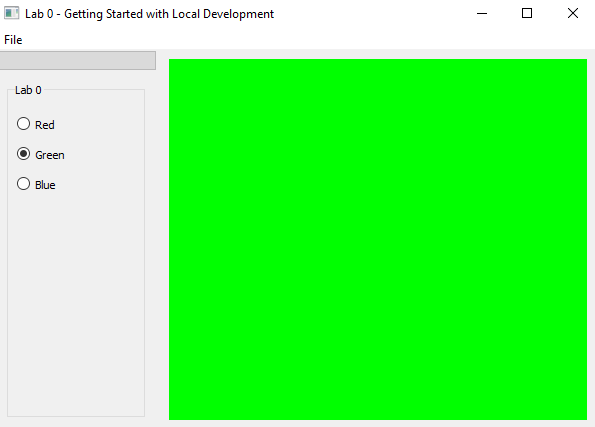
 <p\>

 ##

 
 <p\>
