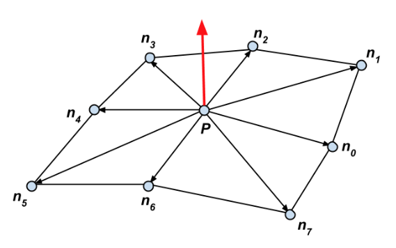

# Lab #2 — Terrain


> "*In a fight between a bear and an alligator, it is the terrain which determines who wins.*"<br/>—&nbsp;Jim Barksdale

## Prologue
In this lab, you’ll generate a rugged, mountainous terrain like in the image above.


## Intro
We will make our terrain generation algorithm using a **noise function** (explained below).
The support code will draw a flat 100x100 grid of vertices. To make our terrain, we use a noise function to adjust the height of each vertex in the grid. This particular terrain generation algorithm does not allow us to make certain geological features (such as caves), but it can still make some pretty cool scenes.

#### *Noise Functions*
A **noise function** is a function that generates a series of pseudo-random values (called “noise”). Noise functions are used for a variety of applications beyond procedural terrain.

- **White noise**: The simplest type of noise is [white noise](https://en.wikipedia.org/wiki/White_noise), in which random values are uniformly distributed. For applications like generating terrain, however, we want there to be a smooth transition between neighboring values, so that there are continuous features (like rugged mountains).

- **Perlin noise**: In 1983, Ken Perlin developed [Perlin noise](https://en.wikipedia.org/wiki/Perlin_noise), which enabled a wide variety of natural-looking effects to be produced with computer graphics (see the "Food for Thought" section at the end of this handout).

- **Value noise**:  In this lab, we will generate [value noise](https://en.wikipedia.org/wiki/Value_noise), which is slightly simpler than Perlin noise and produces similar results.

<br><small><i>From left to right: (1) white noise, (2) Perlin noise, and (3) value noise.</i></small>


## Getting Started
If you have already cloned the lab repo locally during labs before, navigate into `~/course/cs1230/labs` (wherever you cloned the lab repository). Otherwise, you can get the labs starter code by opening up a terminal and running:

`git clone https://github.com/cs123tas/labs.git`

Open Qt Creator and select “Open Project” and find the `lab02.pro` file in your `lab02/` directory.

On the Configure Project screen, make sure Desktop is selected and select “Configure Project.”  Once everything is configured, go to the Projects menu on the left and make sure that the "Shadow build" option is **not** checked.

While there is also a demo version of the lab that can be run by inputting `cs1230_lab02_demo` into your terminal on the department machine through FastX3, there are images along the way that should be sufficient for this lab. See [this link](https://cs.brown.edu/about/system/connecting/fastx/) on how to access department machines through FastX3.


## Make Some Noise
Here, we’ll be doing the very minimum to give some height to our terrain.

#### *Task 1:*
Look at the method `getPosition(int row, int col)`, which returns the position of a vertex in the terrain. Right now, `position.y` (the height of our vertex in 3D space) is always 0, which is why our terrain is currently flat. The inputs `row` and `col` are values between 0 and 99 representing where the vertex is on the grid.

Let’s assign a random value to `position.y` in `Terrain::getPosition(int row, int col)`.  You should use this helper function that we’ve provided:

```cpp
randValue(int row, int col)
```
to generate a random value between -1.0 and 1.0. Use `row` for row and `col` for col.

> *NOTE:* Passing the same arguments to this function will always return the same value.

Now run the program — you should see an extremely jagged surface. Let's improve it!


## Smoothing It Out
Instead of generating a random height for each vertex, we’ll use a smaller grid of random values  and linearly interpolate between them. We can think of this as *scaling up* the grid of random values. It’s similar to *blurring* the grid.

<br>
<small><i>From left to right: (1) 100x100 grid of random values, (2) a closer look at the upper 5x5 grid, and (3) the upper 5x with bilinear interpolation between the values.</i></small>

#### *Task 2:*
In `Terrain::getPosition()`, find the vertex's new position on the upper 5x5 grid.
- Divide `row` and `col` by 20 to find the vertex's new row and column on the upper-left 5x5 grid.
  - `glm::floor(float x)` returns the nearest integer less than or equal to `x`
  - For example, the vertex in row 13 and column 70 in the 100x100 grid will be in row 0 and column 3 in the 5x5 grid because 13/20 = 0.3 (using floor, we get 0) and 70/20 = 3.5 (using floor, we get 3).
- Using `randValue()` and the vertex's new row and column, let's reassign `position.y`.

Once you're done, your grid should now look like this:


For each terrain vertex, you will linearly interpolate between four grid values. This is called **bilinear interpolation**, because you are interpolating in two dimensions. Here's a diagram to show a sample interpolation calculation between four values *A*, *B*, *C*, and *D*:


#### *Task 3:*
In `Terrain::getPosition()`, compute the height for a given terrain position using bilinear interpolation.
- Use the new vertex position on the 5x5 grid and the `randValue()` function to get the four nearest height values of the vertex on the upper-left 5x5 grid (for the picture, that would be *A*, *B*, *C*, and *D*.)
  - If the vertex has less than four neighboring vertices on the upper-left 5x5 grid, you can still use `randValue()` to calculate the height value of the vertex that *would* neighbor the vertex if the grid were larger.
- Use bilinear interpolation between the four heights to compute the vertex's new height.
  - `glm::mix(float a, float b, float x)` linearly interpolates between `a` and `b`, where `x` is in the range `[0, 1]`. Returns `(1 - x) * a + x * b`.
  - `glm::fract(float x)` returns the "fractional" part of `x`.
    - *Ex.* `glm::fract(3.14)` returns `0.14`.

Once you've done that, you should see a grid that looks something like this:


> Tip: Seeing boxes instead of slopes? Make sure you're dividing by *floats* and not accidentally rounding to integers! Also, make sure you're using the right `x`-value for the `glm::mix()` function.

To fix those pointy peaks and valleys, we’ll be using **bicubic interpolation** (instead of bilinear interpolation). Bicubic interpolation uses *cubic functions* instead of lines to transition from one value to the next.

#### *Task 4:*
Switch to bicubic interpolation by remapping the interpolation values.
- If using `glm::mix()`, change the interpolation value `x` to the expression `3x^2 - 2x^3`, as shown below.


> Note that the new `3x^2 - 2x^3` leaves the values `x=0` and `x=1` unchanged. Also, its slope is 0 at both `x=0` and `x=1`. This is why a bicubic function is good for smooth interpolation. All the peaks and valleys will be flat, eliminating sharp edges from slope discontinuities, creating those rolling hills we know and love!

> TLDR: bicubic has smoother interpolation.

You should now see a curved surface that looks something like this:


## Computing Normals
Before adding more improvements to the terrain shape, let's make sure the terrain is *shaded* properly. The support code already implements basic shading — your only job is to compute the **normal vectors** for each vertex.

#### *Task 5:*
Turn off the wireframe.
- In `Terrain`'s initializer list, change `m_isFilledIn` from `false` to `true`.
- This will tell the renderer to display filled-in triangles rather than triangle outlines.

> NOTE: The terrain is currently just a solid white because the normals are all set to `(0, 1, 0)` in `getNormal()`.

We want the surface edges to appear *smooth* instead of faceted. This means that *each normal vector should average the normals of all neighboring triangles*.

Consider a vertex ***P*** surrounded by eight neighboring vertices ***n<sub>0</sub>*** through ***n<sub>7</sub>***. To estimate the normal vector at ***P***, average the normal vectors of the eight neighboring triangles.



- The normal vector of a triangle is the normalized cross product between two of its edges.
- *Ex.* The normal of triangle

   
  
  is
  
  .

#### *Task 6:*
Compute the normal vector at a vertex by taking the average of the normals of the eight neighboring triangles.

- In `Terrain::getNormal()`, use `getPosition()` to get the position of the vertex and its eight neighbors
- Compute the normals of the eight neighboring triangles
  - `glm::cross(glm::vec3 x, glm::vec3 y)` returns the cross product of `x` and `y`
  - `glm::normalize(glm::vec3 x)` returns the normalized vector in the direction of `x`
  - Feel free to ignore edge cases
- Compute the normal of the vertex by taking the average of the normals of the triangles
  - Don't forget to normalize when needed!

Your terrain should now be shaded like so:


> Tip: Still seeing mostly constant grey? Make sure you are crossing in the right order! Crossing in the other order will make the normal go in the opposite direction.


## Noise Octaves
Now let’s return to the terrain shape. How do we make it more *rugged*? Add smaller bumps on top of the large ones that we already have!

How can we make smaller bumps? If we think of the noise function as a wave, “smaller” bumps will have a **higher frequency** and a **lower amplitude**. We already adjusted the frequency once (the “white noise” version from Task 1 had a really high frequency) in `getPosition()`. Think about how you can control frequency and amplitude using a similar technique.

Once smaller bumps are created, you can simply add them to the larger ones! Adding levels of noise like this creates **fractal noise**.


<br><small><i>A 2D example of adding waves of different frequency/amplitude to create more detailed and interesting waves.</i></small>

How much should we increase the frequency between each level? Typically noise functions sequentially increase the frequency by a factor of 2. In this case, the noise levels are called **octaves**. (In music, an octave separates two notes with frequencies that differ by a factor of 2.)

How much should we decrease the amplitude between each level? It’s up to you! Some possible choices include:
- dividing the amplitude by a constant factor at each level
- dividing the amplitude by sequential powers of 2 at each level (check out [glm exponent functions](https://glm.g-truc.net/0.9.4/api/a00130.html)!)

#### *Task 7:*
Create a fractal noise pattern.
- In `Terrain::getPosition()`, add together at least three octaves of noise. Feel free to choose any function you like, as long as the end result looks like terrain.


## End
Now you are ready to show your program to a TA to get checked off!

Be prepared to answer one or more of the following:
- What is a noise function and how do we use it to generate terrains?
- What is the difference between bilinear interpolation and bicubic interpolation, and why are we using bicubic interpolation?
- What is an octave? Explain what the terrain of an octave with high frequency and high amplitude would look like.

#### Food for thought
[Fun demo](https://www.redblobgames.com/articles/noise/introduction.html)

[Fun Noise](https://graphics.pixar.com/library/WaveletNoise/paper.pdf)

[Fun Article About Ken Perlin](https://www.wired.com/1997/01/oscar-is-fx-wizards-reward/) — The original paper is [here](https://dl.acm.org/doi/pdf/10.1145/325165.325247) if you’re interested. Perlin noise was quite popular for quite a while and still sees use today. A main critique about its use is (as Professor Barbara Meier will remark) it’s frankly too easy to recognize due its ubiquitousness for so long.
