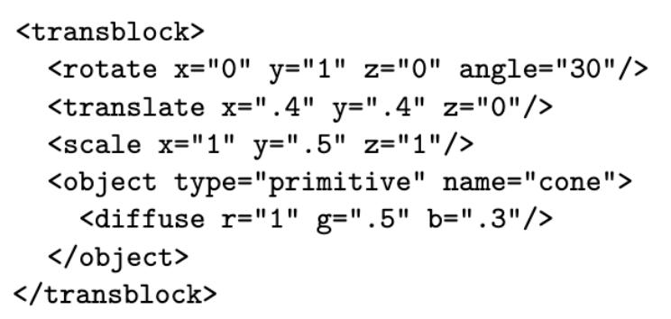
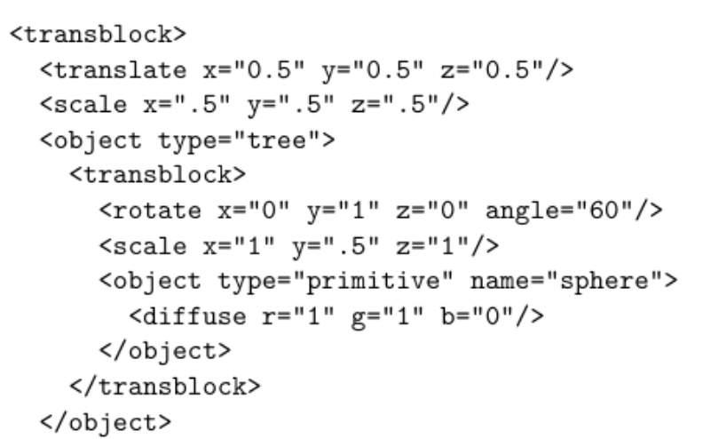
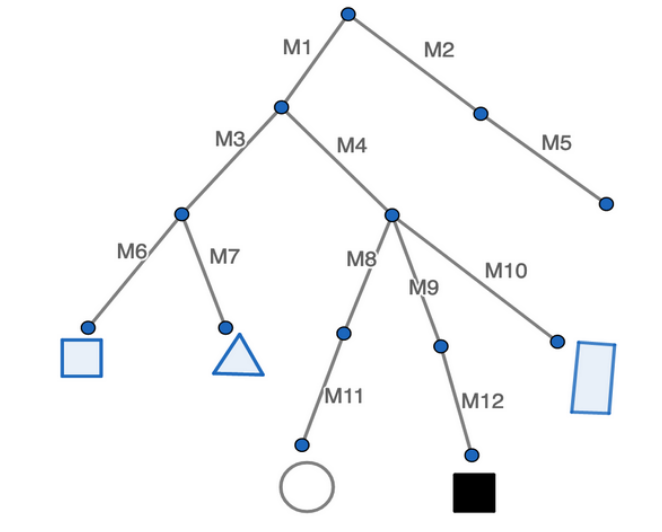

# Lab 03 — Transformations & Scene Graphs

## Intro
In this Lab, you’ll learn what scene graphs are and how to parse them. You will implement a scene file parser, namely `Scene::parse` method, in your project code. Ideally, you will be able to reuse `Scene::parse` in Intersect, Ray and Sceneview assignments without having to make any modifications.

## Understanding Scene Graphs
In order to visualize a complex 3-dimensional scene, thousands of tiny triangles must be drawn to the screen. It would be senseless to require the manual placement of each one of these triangles; instead, we usually define the scene in terms of the various primitives that compose it. Even better, we allow for primitives to be grouped, and then we reference those groups as user-defined primitives. Since such groupings can be nested, our representation of objects in a scene will form a directed acyclic graph, which we will call **scene graph**.

Throughout this course, we will use a CSCI1230-specific scene file format to describe a scene. Our scene file contains necessary information of a scene, namely global data, camera data, light data, and object data. You should refer to [this document](https://github.com/cs123tas/docs/blob/master/2021/scenefile.pdff) to understand scene files and scene graphs in detail.

Now, work on the following exercises!

#### *Task 1:*
Consider the following excerpt from a scene file:

Let C and C’ be the cones before and after applying transformations respectively, and let T, R, S be the translation, rotation, and scale matrices (respectively) corresponding to the transformations in the excerpt. How can you represent C’ with C, T, R, and S? Write your answer in the form of three matrices multiplied with C. Note that the order of multiplications is important since matrix multiplication is not commutative.

#### *Task 2:*
Consider the following excerpt from a scene file with nested transblocks:

Let M1 be the transformation matrix in the outer transblock (translation and scaling), and M2 be the transformation matrix in the inner trans block (rotation and scaling). In what order must you multiply these matrices to obtain a single composite matrix with the desired effect on the primitive sphere object?

#### *Task 3:*
Another way to represent a scene graph is to visualize it as a directed acyclic graph. Consider the following tree representation of a nested scene graph with 5 primitives, where transformation matrices for transblocks are named as M1, M2, and so on. The empty leaf node without any children represents a “tree” transblock with no sub-transblocks. For each primitive object, identify its transformation matrix, represented in the form of matrix multiplication.

## Efficient Parsing
After being sure of the order in which matrices must be multiplied, you should decide how to  efficiently traverse the primitive objects in a scene graph. 

#### *Task 4:*
In the previous exercise, you might have noticed that some matrix multiplications repeat throughout different objects. Explain why traversing a scene graph from the root node every time each object is rendered is inefficient and propose a more efficient approach. Explain how your approach is better in terms of time complexity.

You may get checked off for this lab at this point, but you **must** finish the remaining tasks for Intersect assignment.

## Implement a Parser
Now, you are ready to implement the `static Scene::parse()` method in our project code.

### What `Scene::parse()` should do
When a scene file is opened, the support code (in `loadSceneviewSceneFromParser()` method in `SupportCanvas3D` class) instantiates a new `SceneviewScene` (a subclass of`Scene`) and calls the static `Scene::parse()` method, passing the newly created `SceneviewScene` and an instance of the `CS123ISceneParser`. At this point, the support code has already parsed the xml scene file, so you may assume that you can get all the necessary information in the scene file from the `CS123ISceneParser` instance. For instance, you can get the root node of the scene graph using `parser->getRootNode()`. Refer to `CS123SceneData.h`to learn how our projects represent scene data. 

In `Scene::parse()`, you should set up the global data for the scene, as well as the lighting. You should also traverse the parse tree and add all the objects in the parse tree to your scene. You do not need to set up the camera in this method; this is already handled for you in the support code. 

### Loading Data from the Parser

Resources owned by `CS123ISceneParser` are freed shortly after the `Scene::parse()` method returns. Therefore, you should make copies of `CS123ScenePrimitive` objects (and any other objects inside the parse tree) rather than just copying pointers.

As a design tip, we are providing stencils for `Scene::setGlobal()`, `Scene::addPrimitive()`, `Scene::addLight()` functions. You may implement these functions if you want to use them.

#### *Task 5:*
In `Scene::parse()`, load global data from the input `CS123ISceneParser` instance to the input `Scene` instance. Use the `getGlobalData()` method of the input parser to load global data to its parameter passed by reference. If necessary, add relevant member variable(s) to Scene class.

#### *Task 6:*
In `Scene::parse()`, load light data from the input `CS123ISceneParser` instance to the input `Scene` instance. If necessary, add relevant member variable(s) to Scene class.

#### *Task 7:*
In `Scene::parse()`, load object data from the input `CS123ISceneParser` instance to the input `Scene` instance. After loading the data, you should be able to efficiently keep track of which transformation matrix should be applied to which primitive object. Apply what you learned in **Task 4**. If necessary, add relevant member variable(s) to Scene class.

## Is Our Parser Correct?
Before you finish implementing Intersect, it is difficult to visually check if our parser works correctly. However, one possible way to check if our parser works well is to write a `Scene` method that prints out all or some of the parsed information. You may write a small scene file with a simple scene graph and check if the parsed result is what you expected, or you may use the [example.xml](example.xml) file provided. For instance, you may check if the light position, global data, and primitive objects with their corresponding transformation matrices are correctly loaded.

#### *Task 8 (Optional, but Helpful):*
Write a simple scene file, or choose to use or simplify [example.xml](example.xml). Compute the expected result when your parser parses your scene file. (**Hint**: The scene graph of [example.xml](example.xml) can be visualized as the tree diagram in **Task 3**)

#### *Task 9 (Optional, but Helpful):*
Implement a printing method that prints the parsed information. Call the printing method at the end of `Scene::parse()`. Open the scene file in **Task 8** (To open a scene file, use `File > Open` on the menu bar of our application.) to check if your parser does what you expected.

