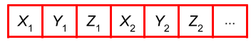
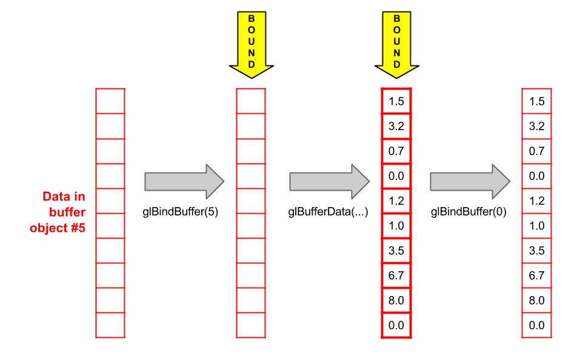
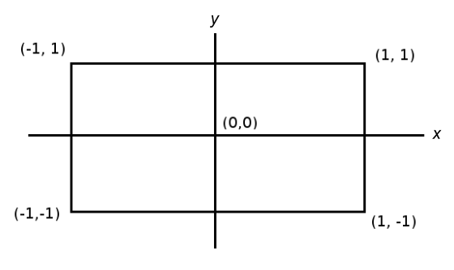
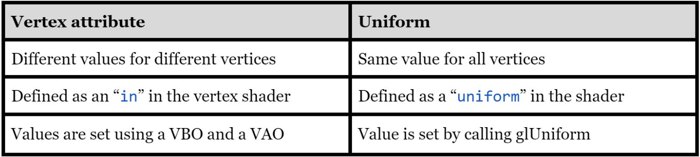
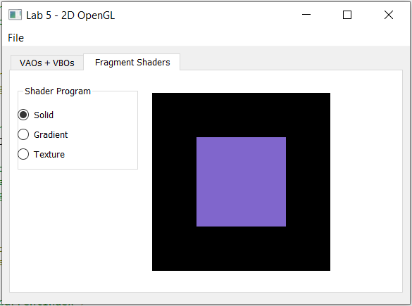
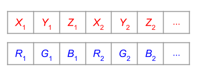
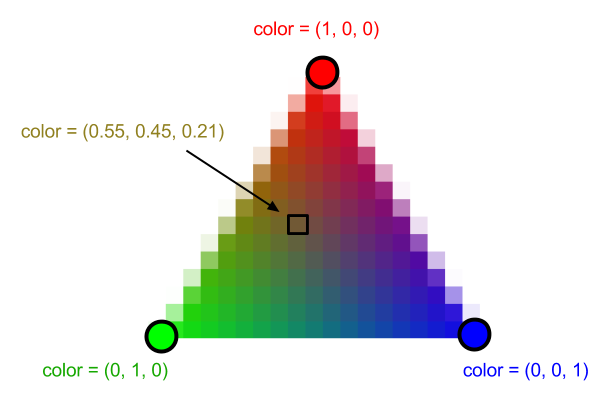
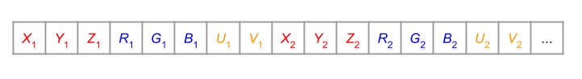

# Lab 5 - 2D OpenGL Basics

## Prologue
========

In this lab you will learn how to draw shapes and use part of a shader program in **OpenGL**. OpenGL, which stands for Open Graphics Library, is a cross-platform API[\[1\]](#ftnt1) that can let you create 2D and 3D graphics using the GPU.

This week’s part of this lab will focus on 2D graphics in OpenGL, including how to draw primitives using vertex data and represent different patterns in 2d

In this lab specifically, you will learn how to create **Vertex Buffer Objects** (VBOs) and **Vertex Array Objects** (VAOs) which will in turn be used to draw triangle primitives (defined below). Code written in this lab will also be used in later labs and projects.

## Getting Started
========

Since you have probably already cloned the lab repo locally during previous labs, navigate into `~/course/cs1230/labs` (wherever you cloned the lab repository) and run the command 
```
git pull origin master
```
To get the most up to date version of lab05!

Otherwise if you need to reclone the directory from scratch you can get the labs starter code by opening up a terminal and running:
```
git clone https://github.com/cs123tas/labs.git
```

## Intro
=====

A high-level diagram of the OpenGL pipeline is given below. For this lab we will start by dealing with the first part: sending vertex data to OpenGL. After a few more labs you’ll begin to understand the inner steps of the pipeline too.


## The GPU
-------

The **GPU**, which stands for Graphics Processing Unit, is a chip located on the graphics card that is specially designed to do graphics-related computations. Rendering using the GPU is ubiquitous in real-time graphics, and nowadays some other fields besides graphics are starting to use the GPU to speed up computations.

It is likely all the programs you have written so far have run on the CPU, or Central Processing Unit. One main difference between the two is parallelism: while the CPU has only a few cores with lots of cache memory, the GPU has hundreds or thousands of smaller cores that can be used for highly parallel tasks. For example in computer graphics, computing the color of a pixel usually does not depend on the color of any other pixels, so they can all be computed in parallel.

OpenGL will act as your interface between the CPU and the GPU. In this lab you will write most things in C++, but at the end of the lab you’ll start working with shaders that run directly on the GPU.

## OpenGL as a state machine
-------------------------

One important thing to know about OpenGL before getting started is that it acts as a state machine. OpenGL has a global state that can be changed in lots of different ways. For example, certain settings (e.g. GL\_DEPTH\_TEST, GL\_BLEND) can be enabled or disabled using the functions glEnable() and glDisable(). Depending on OpenGL’s state, certain operations might behave very differently.

Because of this, it is important to be careful about managing OpenGL’s state during the execution of your programs. There are two strategies for this:

*   **Assume nothing** When writing a function that uses OpenGL, consider that the state could be anything. Explicitly set the values of the state parameters you depend on.
*   **Default configuration.** Decide on a set of reasonable default state values, and set the state to these values at the start of your application. Anywhere you change one of these state parameters, restore the parameter to its previous value after you’re done rendering a component of the scene.

## Getting Started
===============

If you have already cloned the lab repo locally during lab 0, navigate into ~/course/cs1230/labs (wherever you cloned the lab repository). Re-pull the repo with git pull to get any [new changes](https://www.google.com/url?q=https://piazza.com/class/kelk9xgdisb45o?cid%3D15&sa=D&source=editors&ust=1633061486742000&usg=AOvVaw3Av_sgpRkTynQFW5xrNrvd). Otherwise you can get the labs starter code by opening up a terminal and running:

git clone https://github.com/cs123tas/labs.git

Open Qt Creator and select “Open Project” and find the lab05.pro file in your lab05 directory.

On the Configure Project screen, make sure Desktop is selected and select “Configure Project.”  Once everything is configured, go to the Projects menu on the left and make sure that the Shadow build option is **not** checked.

Your job will be to fill in the GLWidget classes, as well as the VBO and VAO classes, and build a basic fragment shader (which we’ll explain more about near the end).

While there is also a demo version of the lab that can be run by inputting cs1230\_lab01\_demo and cs1230\_lab02\_demo (these labs got combined into this lab) into your terminal on the department machine through FastX3, there are images along the way that should be sufficient for this lab. See [this link](https://www.google.com/url?q=https://cs.brown.edu/about/system/connecting/fastx/&sa=D&source=editors&ust=1633061486743000&usg=AOvVaw2as-0b6NcPWDslWiEN5til) on how to access department machines through FastX3.

## Vertex Buffer Objects
=====================

Shapes in OpenGL are composed of triangles, which are defined by three endpoints, or vertices. In order to draw a triangle, you have to send the vertex positions to the GPU.

OpenGL is able to store arrays of data on the GPU in something called a **buffer object**. When a buffer object contains vertex data (such as vertex positions), it’s called a **vertex buffer object**, or **VBO**. There is a good amount of boilerplate setup code that you need to create an OpenGL VBO.  In this lab, we’ll fill out a template for a VBO class that makes it easier to create and manage them on the CPU (you’ll be able to reuse this code in later projects).



Vertex positions (x, y, z) stored in a VBO

The VBO.cpp class will represent a triangle mesh that can be drawn using OpenGL. We want this class to represent, on the CPU side, an OpenGL VBO that will store its triangles’ vertex positions. The first step is to create a new OpenGL VBO on the GPU.

### Task 1:

In Sources/src/gl/datatype, find VBO.cpp. In VBO’s constructor, create a new OpenGL VBO by calling glGenBuffers(n, buffers):

*   Use 1 for the first argument n. This indicates we only want to create one VBO.
*   For the argument buffers, pass a pointer to m\_handle. The ID of the newly created VBO will be stored in m\_handle. This will allow us to refer to this VBO later.

Now that a VBO has been created, we can send vertex data to it. This is done with a function called glBufferData. Because an OpenGL program might have many different buffer objects, we need a way to indicate which one we’d like to send data to. Since OpenGL is one large state machine, it automatically uses a single, currently bound buffer object, which you can set using glBindBuffer.



To fill in buffer object #5 with vertex data, we first bind buffer object #5 using glBindBuffer. Then we call glBufferData, which stores the data in the currently bound buffer object. Finally, we unbind the buffer object by passing 0 to glBindBuffer (Note: this diagram omits an additional argument that glBindBuffer takes in).

This is one example of what we mean when we say OpenGL is a state machine. Depending on the current state (i.e. the currently bound buffer object) glBufferData will do different things.

### Task 2:

In VBO’s constructor, let’s send the “data” array to the VBO you created in Task 1.

*   First call glBindBuffer(target, buffer):

  *   The argument target should be GL\_ARRAY\_BUFFER. Using GL\_ARRAY\_BUFFER indicates that our buffer object will store vertex attributes (discussed below).
  *   The argument buffer should be m\_handle.

*   Next call glBufferData(target, size, data, usage):

  *   The argument target is again GL\_ARRAY\_BUFFER.
  *   For size, which is the size in bytes of the data, use sizeInFloats \* sizeof(GLfloat).
  *   The data argument is the data parameter to the constructor.
  *   Use GL\_STATIC\_DRAW for the usage parameter. This indicates that we do not expect the vertex data to be modified, allowing OpenGL to optimize for that.

*   Lastly, unbind the buffer using glBindBuffer(target, buffer):  
(it is good practice to undo any changes you make to OpenGL’s state)
  *   The target is the same as the previous functions.
  *   buffer should just be 0 to unbind.

Tip: Check out the OpenGL reference pages for more information on glBindBuffer and glBufferData, and later on in labs for other operations to learn more about what they do and what arguments they take in!

#### What does this task do?

We were able to send our VBO the proper data by first binding and then calling glBufferData. You can think of binding as setting the “current” array buffer (GL\_ARRAY\_BUFFER) to the buffer object we created. OpenGL uses the currently bound array buffer for operations like sending data with glBufferData!

## Vertex Array Objects
====================

Now we are able to send vertex positions to OpenGL, but we still have a few more steps before our OpenGLShape class can draw this data. Specifically, we need to let OpenGL know that the VBO will be storing vertex positions! In this lab we will only be worried about positions, but in larger programs each vertex could have lots of other **attributes** that we’d want to store in a VBO (color, normal vector, etc.).

In order to associate attributes with the data in the VBO, we need something called a **vertex array object**, or **VAO**. This is a pretty confusing name, as it’s not actually an array of vertex data. (That’s the VBO!) The VAO is an object that knows how to draw the data in a VBO because it knows what attributes are stored in it.  In fact, once you create a VAO and properly associate the data in a VBO with it, you don’t need to save the VBO anywhere. The VAO is all you need to draw the vertex data.


### Task 3:

In VAO’s constructor, generate a new VAO using glGenVertexArrays(n, arrays):

*   The first argument should be 1 as before, as we only want 1 VAO.
*   The arrays argument should be a pointer to m\_handle.

Now we can tell the VAO how the data is stored in the VBO.

### Task 4:

*   In VAO’s constructor, perform the VAO setup (we’ll fill in these methods soon):

  *   Bind the VAO by calling bind().
  *   Bind the VBO by calling vbo.bindAndEnable(). Both of these are needed because we are linking the VAO with the VBO’s data.
  *   Unbind the VBO by calling vbo.unbind().
  *   Unbind the VAO by calling unbind().

*   Fill in VAO::bind():

  *   Call glBindVertexArray(array) using m\_handle as the parameter.

*   Write VAO::unbind() by binding 0 as the vertex array.
*   **Now back to the VBO file!** Fill in VBO::bind() and VBO::unbind():

  *   Bind the VBO using glBindBuffer(target, buffer) with m\_handle to the array buffer (GL\_ARRAY\_BUFFER).
  *   The target is GL\_ARRAY\_BUFFER and the buffer is m\_handle.

*   In VBO::bindAndEnable(), enable each attribute in the loop:

  *   Call glEnableVertexAttribArray(am.index).
  *   Then call glVertexAttribPointer(index, size, type, normalized, stride, pointer) using each VBOAttribMarker. This function defines how an attribute is stored in a VBO:

    *   Use am.index as the first parameter.
    *   Use am.numElements as the second parameter.
    *   Use m\_stride as the fifth parameter.
    *   For the pointer parameter, you must cast to a (GLvoid\*): reinterpret\_cast<GLvoid\*>(am.offset).
    *   Continue to use properties of am for the other parameters. Look up glVertexAttribPointer to see the [documentation](https://www.google.com/url?q=https://www.khronos.org/registry/OpenGL-Refpages/gl4/html/glVertexAttribPointer.xhtml&sa=D&source=editors&ust=1633061486751000&usg=AOvVaw2PS28TMCeLRaTxb2y8_UHY).

#### What does this task do?

Here we associated a VBO with a VAO. Based on the OpenGL attributes we let the GPU know how to draw the vertex data which can be done again and again at relatively low cost (since it is ready in GPU memory). Take a look at OpenGLShape to see how we use these classes in practice.
* Notice that we don’t even have to save our VBO anywhere.
* Once we bind everything properly, the VAO can still draw it, even if the data is deleted on the CPU. This works because the data exists on the GPU now.

### Task 5:

We are finally ready to fill in the draw method!

*   Open openglshape.cpp. In OpenGLShape::draw(), bind() the VAO and call m\_VAO->draw().
*   In VAO::draw(), in the DRAW\_ARRAY case, call glDrawArrays(mode, first, count).  This draws the vertices associated with the currently bound VAO:

  *   For the first parameter, use m\_triangleLayout.
  *   For the second parameter, assume that we want to draw starting at the beginning of the VBO’s data store (meaning an offset of 0 bytes).
  *   For the last parameter, use count.

*   Don’t forget to unbind the VAO back in OpenGLShape::draw()!

Note that you do not need to bind the VBO in order to draw. The VAO knows which VBO(s) to use based on which VBO was bound when the VAO was last bound.

To summarize, we now have a class OpenGLShape that can:

1.  Store data in a VBO and bind it to a VAO.
2.  Enable/define attributes using a VAO.
3.  Draw the vertices.

### Task 6:

The last thing we need to do is clean up the GPU memory. You already know that when you call “new” to allocate CPU memory, you need to call “delete” to free it or else your program will leak memory. Similarly, calling glGen\* allocates memory on the GPU, which we need to free using glDelete\*.

*   In VBO’s destructor, delete the VBO using glDeleteBuffers(...).
*   In VAO’s destructor, delete the VAO using glDeleteVertexArrays(...).

Tip: The first parameters should be 1, as we are just deleting 1 ID each time.

## Drawing a triangle
==================

Phew! We have now done all the dirty work necessary to draw shapes using OpenGL. Let’s get drawing!

Go to glwidget.cpp, a subclass of QGLWidget. This has two methods that we will be overriding:

*   initializeGL() – Called once at the beginning of the program. Used for initializing shapes and specifying OpenGL settings.
*   paintGL() – Called every time the screen should be updated. In an animated program like a video game, this might be called ~60 times per second.

Let’s set up the vertex positions for a triangle. First we need to know what coordinate system we’re using.

OpenGL’s screen coordinate system looks like this, where -1 ≤ x ≤ 1 and -1 ≤ y ≤ 1:



When giving OpenGL a vertex position, you will also need to specify a z-coordinate. Since we are only drawing 2D shapes in this lab, set z equal to 0 for all vertices. (In the next lab we will start using other z values to create a 3D scene.)

For this lab you should choose three vertex positions for a triangle that looks like this:


When storing the vertex positions in an array, make sure they’re defined in counterclockwise order! In GLWidget::initializeGL() we enabled GL\_CULL\_FACE, which makes sure only counter-clockwise faces are drawn. This is a common feature to enable, because without it the program would spend time drawing both sides of each face, when only one may ever be visible.

### Task 7:

In GLWidget::initializeTriangle():

*   We've made a std::vector of floats containing the X, Y and Z coordinates of the triangle’s three vertices for you. Pass the vertex data to m\_triangle using setVertexData(data, size, drawMode, numVertices):

  *   To get the pointer to the data for the first argument of your vertices, you can use vector.data() or &vector\[0\].
  *   size is the number of elements in your array
  *   drawMode is VBO::GEOMETRY\_LAYOUT::LAYOUT\_TRIANGLES.
  *   The last argument is the number of vertices in your array (in this case, 3).

*   Call setAttribute(index, numElementsPerVertex, offset, type, normalize):

  *   index is ShaderAttrib::POSITION for this lab.
  *   numElementsPerVertex refers to the number of coordinates of the attribute - in this case we have three: x, y, and z.
  *   Your offset is 0, because the vertex data only contains positions.
  *   type is the data type: use VBOAttribMarker::DATA\_TYPE::FLOAT for float data.
  *   Set normalize to false. Setting it to true automatically maps floats to the range \[-1, 1\].

*   You have to tell our OpenGLShape that you’re done setting data and attributes so it will generate the VAO.  Do this by calling m\_triangle->buildVAO().

Now that the triangle has been initialized, we can finally draw it!

### Task 8:

In GLWidget::paintGL(), draw m\_triangle. You should see your very first triangle!

**If you don’t see your triangle:**

*   Make sure your vertices are defined in counterclockwise order.
*   Make sure you define X, Y, and Z coordinates.
*   Double check the arguments to your OpenGL function calls.
*   If none of these work, ask a TA for help.

Oof, that sure was a lot of work to draw a lousy triangle. The good news is, now that we’ve made some handy dandy classes to wrap all those OpenGL functions, we can make new shapes fairly easily.

**Make sure this part of your lab works before moving on to the next part! Your shaders will not work without functioning VBOs/VAOs**


## Shaders Intro
=============

Before we move into using shaders in 2D, let’s talk about where they fall in the real-time graphics rendering pipeline. Shaders run directly on the GPU, so they are a lot faster for image calculations and can render images faster. Once we have the vertex data, we can use a **vertex shader** to run an operation on each vertex. This is very quick for applying transformations to primitives. The other shaders in the graphics pipeline are **fragment shaders**. Fragment shaders run on every pixel (of every polygon) to output a color. (For the purposes of this lab we will use the terms “fragment” and “pixel” interchangeably.[\[2\]](#ftnt2))

However, since we’re working in 2D during this lab, vertex shaders aren’t as useful here because there’s no need to do complex vertex stuff for this week’s lab. So, we’ll be focusing on what we can do with fragment shaders.

Here’s the OpenGL pipeline again so you can see where fragment shaders fit in:


A vertex shader and a fragment shader are combined to create something called a **shader program**, which is required to draw anything with OpenGL.
* There are other types of shaders (tessellation and geometry) that can be added to a shader program as well, but they’re optional.

The function for creating a shader program from a vertex and fragment shader is already written for you in ResourceLoader::createShaderProgram(...), which returns the new shader program’s ID.

Often you’ll have multiple shader programs to render different objects differently. You can change which shader program you’re using by passing a program ID to glUseProgram.

Before we start writing fragment shaders, let’s set up a simple square to test them on.

### Task 9:

*   Open the methods GLFragWidget::initializeGLFragmentShaders() and GLFragWidget::paintGLFragmentShaders().  We will now be working in the second tab of the application.
*   In paintGLFragmentShaders(), set the active program with glUseProgram to m\_solidProgramID.
*   Draw the m\_square.
*   After drawing, unbind the shader program by calling glUseProgram(0).
*   Run your program.  Go to the “Fragment Shaders” tab.  You should see a white square on the screen.

Let’s take a look at a fragment shader before we move on. Open the file Other Files/shaders/shader.frag. It is written in a language called GLSL (OpenGL Shading Language) which is designed to resemble C. Let’s take a closer look:

*   #version 400

  *   All shaders begin with a line like this that identifies the GLSL version being used.

*   uniform vec3 color;

  *   This is a uniform variable, which is defined below this. It’s an input for this shader

*   out vec3 fragColor;

  *   This declares an output variable with type vec3 that is called fragColor.
  *   This will become the output to the shader, or its final color

*   void main() { ... }

  *   All fragment shaders must contain a main function, which is automatically called for each fragment.

The shader program referenced by m\_solidProgramID uses the shaders solid.vert and solid.frag.

*   Take a look at the file solid.vert.

  *   All it does is set gl\_Position to the position attribute. We’re not using 3D in this lab so we don’t have to worry about the model, view, and projection matrices.

*   Now take a look at the file solid.frag.

  *   It should look very similar to the vertex shader. Instead of outputting the color to a built-in variable like gl\_Position, we output to a custom “out” variable, which we have named fragColor.
  *   Currently the fragment shader just outputs white: (r, g, b) = (1, 1, 1).

## Uniform Variables
=================

Right now, if we want to change the color of the square in our real-time pipeline, we would have to edit the fragment shader itself. This can get tedious, especially if we’d like to do something like texture mapping. The solution? A uniform!

A **uniform** is a value that is the same for all vertices. To set the value of a uniform, you must call glUniform before drawing. On each execution of the vertex shader, it will use the last value that was set using glUniform.

Here’s a chart to summarize the differences between a vertex attributes and uniforms:



The first argument of glUniform is the “location” of the uniform variable, which you can obtain from glGetUniformLocation.

Here’s an example of setting a uniform variable with type vec3:

```
// This sets the active shaders. It must be called before setting

// any uniforms.

glUseProgram(m\_program);

// Gets the uniform location from the program.

GLint uniformLoc = glGetUniformLocation(m\_program, “myUniform”);

// Sets the uniform to (1, 0, 0).

glUniform3f(uniformLoc, 1, 0, 0);

// Draws the shape with myUniform set to (1, 0, 0).

m\_shape->draw();

// Alternatively you can use glUniform\*v and pass a pointer to a GLM

// type.

glm::vec3 v = glm::vec3(0, 1, 0);

glUniform3fv(uniformLoc, 1, glm::value\_ptr(v));

// Draws the shape
```

For this shader program, we would like to send a color as a uniform to the shader, and set each pixel to that color. Uniforms work exactly the same in fragment and vertex shaders, so this will function the same as we work with vertex shaders later.

### Task 10:

*   In solid.frag declare a “color” uniform and set the fragColor to the uniform’s value.
*   In GLFragWidget::paintGLFragmentShaders(), set the uniform's value to a color other than white.
*   You should now see the square rendered as a different color (See below for an example with purple color).

*   Remember that uniforms need to be set **after** the shader program is bound and **before** the shape is drawn.



Tip: Look back at the previous section if you are having trouble!

## Multiple Vertex Attributes

Now let’s make our square a little more interesting by making a color gradient.


To do this, we assign each vertex a color, as shown above, and have the pixels interpolate their color between these vertices.

How do we assign a color to each vertex? We'll treat color as another vertex attribute just like position. This means we’re going to store the vertex colors in a VBO (Vertex Buffer Object), and tell the VAO (Vertex Array Object) how the color attribute is stored. One way we could do this would be to create separate VBOs for vertex positions and vertex colors, like so:



Instead, we’re going to interleave the positions and colors in the same VBO. This ends up being the fastest option, because all the attributes for a given vertex are stored contiguously in memory.


We need to inform the VAO about how the attributes are interleaved. We can do this using OpenGLShape::setAttribute.  “offset” indicates the offset in bytes from the beginning of the VBO’s data store to the first element in each attribute (in other words, how many bytes are before that attribute in each vertex).

Let’s add the color data to our VBO, and then we’ll discuss how to use it in the fragment shader.

### Task 11:

*   Interleave positions and colors in the array used to initialize m\_square. (i.e. add in color information for each vertex after its position in the array)
  * Each vertex will have 3 values for color (r, g, b)
*   Now you will need two calls to OpenGLShape::setAttribute.

  *   Use ShaderAttrib::COLOR as the “name” for the color attribute.
  *   Remember that “offset” is in bytes (a float is 4 bytes).
* Update the stride argument to setVertexData (the last argument) to divide by the new number of floats for each vertex

*   Run your program and make sure the square still shows up.

Tip: See a triangle? Make sure you updated the parameters to setVertexData as well!

## Vertex Shader Output
====================

Let’s turn our attention to gradient.vert and gradient.frag. Since we just added a new vertex attribute, let’s declare a new input in the vertex shader.

### Task 12:

*   In gradient.vert, add a new “in” variable for the color attribute.
*   Set its location to 2.
  * Hint: check out the first line in gradient.vert for the syntax

  *   We choose 2 instead of 1 because in ShaderAttribLocation.h, we defined the color location (ShaderAttrib::COLOR) to be 2.

Another use for vertex shaders besides transforming vertex positions is to send outputs to the fragment shader. An **output** variable is declared as an “out” in the vertex shader and an “in” in the fragment shader. For each pixel in a triangle, the fragment shader interpolates the output values from the triangle’s vertices.



### Task 13:

*   In gradient.vert, declare a new “out vec3” to send the color attribute to the fragment shader.

  *   Set its value to the vertex attribute’s value.
  *   (Note that the vertex shader’s out variable has to have a different name from its in variable.)

*   In gradient.frag, make a new “in vec3” with the same name as the vertex shader's output. Set the pixel color (fragColor) to that value.
*   In GLFragWidget::paintGLFragmentShaders(), set the active shader program to m\_gradientProgramID.
*   Draw the square in the appropriate switch case.
*   You should now see a gradient when you run your program as shown below!

  *  


Congrats! You're done with the required part of this lab

## Textures (Optional)
===================

This part is optional because of the length of this lab, but is useful to reference for final projects, so you can do it if you choose :)

Now let's move on to texture.vert and texture.frag. We’ll use these shaders to render a **texture**, or image, on the square.

The first step is to load a texture into OpenGL. A texture object is created and bound using glGenTextures and glBindTexture, with GL\_TEXTURE\_2D as the target. You can send image data to the bound texture using glTexImage2D (similar to how we use glBufferData to send data to a buffer object). Here are some notes about how to use its arguments in this lab:

*   Set “level” to 0
*   Set “internalformat” and “format” to GL\_RGBA
*   Set “type” to GL\_UNSIGNED\_BYTE
*   Set “data” to image.bits()
*   And yes, you read the documentation correctly. There is a parameter that “must be 0”…

The last thing we need to do is set two texture parameters. The image we are using is 585 pixels by 585 pixels. Depending on the size of the textured object that gets rendered, the original image will likely have to be scaled up or down. OpenGL has a few built-in ways to scale images, and you’re required to specify which one you want before you can use the texture.

The parameters that control the scaling technique are called GL\_TEXTURE\_MAG\_FILTER and GL\_TEXTURE\_MIN\_FILTER, for scaling up (MAGnifying) and scaling down (MINifying). For now, just set them to GL\_NEAREST. You can set these parameters using glTexParameteri, which takes three arguments. Notice that the second argument is the parameter name (e.g., the OpenGL enums for max and min filtering) while the third argument is the parameter value.

### Task 14:

*   In GLFragWidget::initializeGLFragmentShaders(), initialize a texture object using m\_textureID and the provided QImage.

  *   Call glGenTextures passing in 1 for n and &m\_textureID for textures.
  *   Call glBindTexture using GL\_TEXTURE\_2D as the target and m\_textureID as the texture.
  *   Call glTexParameteri passing in GL\_TEXTURE\_2D as the target, GL\_TEXTURE\_MAG\_FILTER as the pname, and GL\_NEAREST as the param.
  *   Call glTexParameteri again, but use the GL\_TEXTURE\_MIN\_FILTER as the pname this time.
  *   Call glTexImage2D passing in

    *   GL\_TEXTURE\_2D as the target,
    *   0 as the level,
    *   GL\_RGBA as the internalformat,
    *   image.width() & image.height() for width and height, respectively,
    *   0 for the border,
    *   GL\_RGBA for the format,
    *   GL\_UNSIGNED\_BYTE for the type,
    *   and image.bits() for the data.

Before moving to the shaders, we need to add another vertex attribute to the VBO. Each vertex corresponds to a different corner of the image. To specify the corner for each vertex, we will use UV-coordinates. In UV-coordinates (0, 0) refers to the top left of the image and (1, 1) is the bottom right.


### Task 15:

*   Interleave UV-coordinates along with positions and colors in your VBO.
*   Adjust your calls to setAttribute & setVertexData accordingly.
*   Use ShaderAttrib::TEXCOORD0 as the attribute index and note that the number of elements in the new attribute is 2, not 3.
*   Run your program and make sure the first two shader programs still work in the fragment shaders tab.

Your VBO should now be structured something like this:



Now it’s time to move to texture.vert and texture.frag. In this shader program we want to interpolate the UV-coordinates across all pixels. That way each pixel has a unique set of UV-coordinates and can look up the correct texel in the texture. (A texel is a pixel in the texture image. The distinction is made so as not to confuse this with pixels on the screen.)

We need a way to access the texture from the fragment shader. In GLSL the type sampler2D represents a texture. Since we’re using the same image for the entire object, you will declare it as a uniform.

Unlike the other uniforms we’ve seen, you do not have to call glUniform to set the texture uniform’s value. Instead, make sure the texture is bound to GL\_TEXTURE\_2D when you draw. OpenGL will automatically send this texture to the sampler2D uniform declared in the fragment shader.

### Task 16:

Use texture.vert and texture.frag to interpolate UV-coordinates across the image.

*   In the fragment shader, declare a sampler2D uniform.
*   Set the output fragColor to the corresponding texel by calling the GLSL function “texture” which uses the sampler2D and the uv-coordinates.

  *   texture(sampler2d, uv “in” vector)

*   In GLWidget::paintGLFragmentShaders():

  *   Use m\_textureProgramID.
  *   Bind m\_textureID to GL\_TEXTURE\_2D using glBindTexture.
  *   Draw the square & unbind the shader program!

*   You should see an image displayed on the square as shown below!
*   Also, remember that this is C++, where you have to clean up your resources.  In this case, we have to delete the texture we gave to OpenGL.

  *   Luckily, there’s a handy glDeleteTextures function just for this! Call it in your GLWidget’s destructor by passing in 1 for n and &m\_textureID for textures


## End
===

Congratulations! You have finished your first OpenGL lab. We encourage you to reuse the VBO and VAO classes you created in this lab for future projects. Feel free to copy them over to your projects folder (replace the template ones in gl/datatype).

Now you are ready to show your program to a TA to get checked off!

Be prepared to answer one or more of the following:

*   What is OpenGL? Why is it sometimes referred to as a state machine?
*   What is a VBO and why is it important?
*   What is a VAO and why is it important?
*   What were the drawing modes covered in this lab and how do they differ?
*   What is a uniform variable?

* * *

[\[1\]](#ftnt_ref1) Technically OpenGL is really a specification for an API. Graphics cards typically have their own OpenGL implementation that implements the functionality in the OpenGL specification.

[\[2\]](#ftnt_ref2) What’s the difference between a “fragment” and a “pixel”? A “fragment” is actually a collection of data about a piece of a geometric primitive. It may include position, texture coordinates, depth, and more, all of which are used in determining how to color a final pixel. The output of a fragment shader (i.e. a fragment) is not necessarily written to a pixel in the rendered image. This could happen if you’re rendering a polygon that’s behind one that has already been drawn. It is also possible to use multisampling (see Image Processing 2 lecture), which runs multiple fragment shaders per pixel and averages the results, in which case there is not a one-to-one relationship between fragments and pixels.
