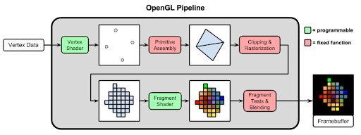
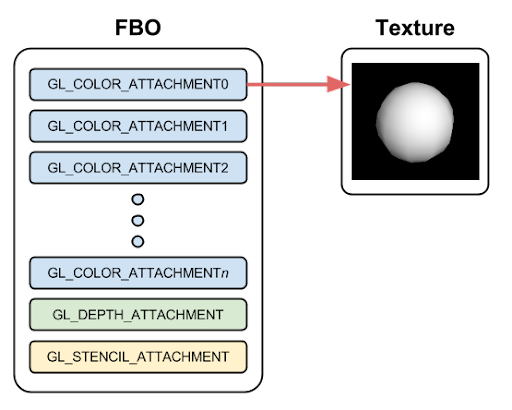
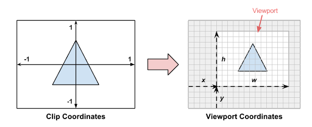
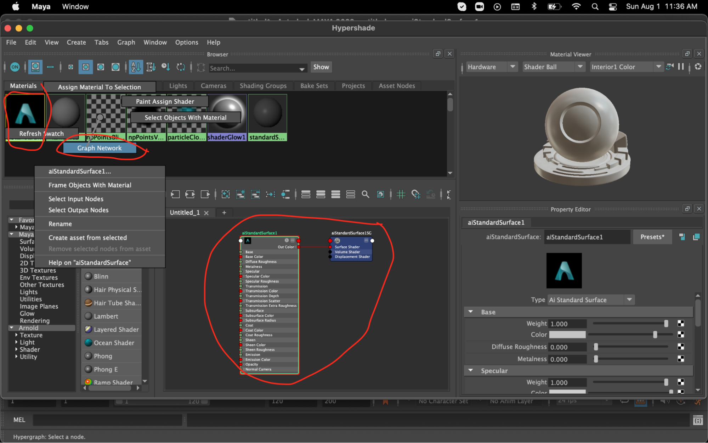
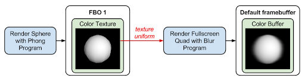
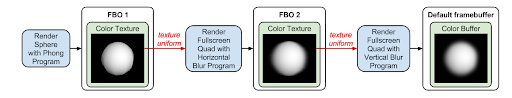
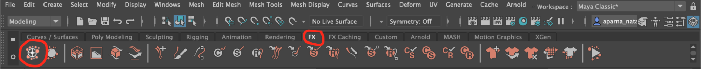

#  Lab 8 - Framebuffer Objects

# Prologue

Until now, everything we rendered with OpenGL was displayed directly on the screen. This was fine for our purposes so far, but many graphics techniques require rendering a scene _to a texture_, which can then be used when rendering the final image on the screen.

In this lab we will learn how to render to a texture, which opens up many possibilities for doing cool things with OpenGL.

# Getting Started

If you have already cloned the lab repo locally during labs before, navigate into ~/course/cs1230/labs (wherever you cloned the lab repository). Otherwise you can get the labs starter code by opening up a terminal and running:

git clone https://github.com/cs123tas/labs.git

Open Qt Creator and select “Open Project” and find the lab07.pro file in your lab07 directory.

On the Configure Project screen, make sure Desktop is selected and select “Configure Project.”  Once everything is configured, go to the Projects menu on the left and make sure that the Shadow build option is **not** checked.

While there is also a demo version of the lab that can be run by inputting _cs1230_lab07_demo_ into your terminal on the department machine through FastX3, there are images along the way that should be sufficient for this lab. See [this link](https://cs.brown.edu/about/system/connecting/fastx/) on how to access department machines through FastX3. 

Copy the support code into your own directory and open up _glwidget.cpp_. In` initializeGL()`, we have already created some shader programs (with shaders you will write), and initialized a sphere. The Phong shaders are already written for you.

# Drawing a Sphere

Let’s start by simply rendering the sphere to the screen.

### Task 1:

In `drawBlur()`, render `m_sphere`. Perform the following steps in order:

* Clear the color and depth buffers (`GL_COLOR_BUFFER_BIT `and `GL_DEPTH_BUFFER_BIT`) before drawing.
    * Recall `glClear(buffer_bit_name)`
* Use the shader program `m_phongProgram`.
    * Recall that `glUseProgram(m_program)` sets the active shaders
* Set the “view” and “projection” uniforms using `m_view` and `m_projection`. Set the “model” uniform to the identity matrix. 
    * `GLint uniformLoc = glGetUniformLocation(m_program, "myUniform")` gets the uniform location of `myUniform` from `m_program`
    * `glUniformMatrix4fv(GLint location, GLsizei count, GLboolean transpose, const GLfloat *value)` sets the uniform to `value`
    * glm::value_ptr(v) returns a pointer of type const GLfloat * to v 
    * _Note: remember the default constructor for a <code>glm::mat4x4</code> is the identity matrix!</em>
* Resize the viewport to match window size with <code>glViewport(<em>x</em>, <em>y</em>, <em>width</em>, <em>height</em>)</code>
    * <code><em>x</em></code> and <code><em>y</em></code> should be <code>0</code> since that’s the bottom left of the window
    * <code>m_width </code>and<code> m_height </code>are the window’s <code><em>width </em></code>and <code><em>height</em></code>
* Call <code>m_sphere->draw() </code>to draw the sphere.

You should now see a simple white sphere on the screen!

# Framebuffer Objects

Our next goal is to render this sphere to a texture. To do this we will use something called a **framebuffer object**, or **FBO**. We’ve seen the word “framebuffer” before, at the end of the OpenGL pipeline:

A **framebuffer** is a collection of textures[^1] that you can render into (think of a texture as an image here). So far we’ve rendered to the **default framebuffer**, whose color is automatically displayed on the screen after each call to paintGL().

In this lab we will implement a class called FBO, which is a wrapper for some OpenGL functions (similar to VBO and VAO from Lab 1). We will also implement a Texture wrapper class, since the FBO needs to have at least one associated texture.

Take a look at _gl/datatype/FBO.cpp_. In the constructor, we will first create an FBO and a color texture with the given dimensions. This texture code is further abstracted out into a Texture2D class. The texture code should look familiar to you from Lab 3.

### Task 2:

* In the FBO constructor, call
    * <code>[glGenFramebuffers(count, handle)](https://www.khronos.org/registry/OpenGL-Refpages/gl4/html/glGenFramebuffers.xhtml).</code>
        * This generates <code><em>count</em></code> framebuffers and place a reference to them in <code><em>handle</em></code>.
        * <code>1 </code>is the <code><em>count </em></code>(you’re creating 1 framebuffer).
        * Use a pointer to <code>m_handle</code> as <code><em>handle.</em></code>
    * Don’t forget to glDelete* as well!
* In the <em>gl/textures/Texture.cpp </em>constructor
    * Create a new texture using <code>glGenTextures</code> by passing in 1 and a pointer to <code>m_handle.</code>
    * This constructor will get called by Texture2D’s constructor, because Texture2D inherits from Texture.
* In the <em>gl/textures/Texture2D</em>
    * In the constructor:
        * Call <code>bind().</code>
        * Initialize the texture using <code>[glTexImage2D](https://www.khronos.org/registry/OpenGL-Refpages/gl4/html/glTexImage2D.xhtml)</code>.
            * Use <code>GL_TEXTURE_2D </code>for “<code>target</code>”.
            * Use <code>0</code> for “<code>level</code>,”  the <code>internalFormat</code> variable for the “<code>internalFormat</code>” argument,  <code>0</code> for the <code>border</code> argument, <code>GL_RGBA</code> for the “<code>format</code>” argument,and the <code>type</code> variable for the “<code>type</code>.”[^2]

            * For “`width`,” “`height`,” and “`pixels`”, use the constructor’s parameters. (Use `data` for “`pixels`”)
    * In `bind()`, bind the texture using` glBindTexture`.
        * Use `GL_TEXTURE_2D `for `target`
        * Use `m_handle` for `texture`
    * Don’t forget to unbind as well!
* In `FBO::generateColorAttachment() `(note: not<code> generateColorAttachment<strong>s</strong>()</code>)
    * This method generates Texture attachments for an FBO (more on this in the next section). Set the texture’s filter and wrap methods (<strong>see the inline comments for how to do this</strong>!). 
* In textures/<code>TextureParameters::applyTo</code>
    * Call <code>[glTexParameteri](https://www.khronos.org/registry/OpenGL-Refpages/gl4/html/glTexParameter.xhtml)(target, pname, param) </code>4 times, following the instructions in the comments
        * Use <code>GL_TEXTURE_2D</code> for the<code> target</code>, <code>GL_TEXTURE_MIN_FILTER</code> for the <code>pname</code>, and <code>filterEnum </code> for the <code>param</code>.
        * Then use <code>GL_TEXTURE_2D</code> for the<code> target</code>, <code>GL_TEXTURE_MAG_FILTER</code> for the <code>pname</code>, and <code>filterEnum </code> for the <code>param</code>.
        * Now to set up the wraps… Use <code>GL_TEXTURE_2D</code> for the<code> target</code>, <code>GL_TEXTURE_WRAP_S</code> for the <code>pname</code>, and <code>wrapEnum</code> for the <code>param</code>.
        * Use <code>GL_TEXTURE_2D</code> for the<code> target</code>, <code>GL_TEXTURE_WRAP_T</code> for the <code>pname</code>, and <code>wrapEnum</code> for the <code>param</code>.
    * Our filter method defaults to <code>GL_LINEAR</code> and our wrap method defaults to <code>GL_REPEAT</code>. 
* You should still see your sphere at this point!

<em>Tip: Throughout this lab, you will fill in a few different classes, including FBO.cpp, Texture.cpp, Texture2D.cpp, DepthBuffer.cpp, and RenderBuffer.cpp.  These classes will have OpenGL glGen*** and glBind*** calls in them. As you fill these classes out, make sure you are always deleting any OpenGL objects you generate by calling the appropriate glDelete*** method in the destructors using the same parameters, and make sure you are matching each glBind*** call to the appropriate unbind (binding the handle back to 0).  The TAs will check that you aren’t leaking any memory!</em>

Next we have to **attach** the texture to the FBO. FBOs have a number of “attachment points” that allow you to render into different textures.

Whenever a fragment shader outputs a single color, it will by default be written to the _first color attachment _of the currently bound FBO. The first color attachment point is called `GL_COLOR_ATTACHMENT0`; that’s the one we want to attach our texture to.

### Task 3:

* In the FBO constructor…
    * Bind the FBO by calling `bind()`
    * Call `generateColorAttachments()`
        * Pass in `numberOfColorAttachments`, `wrapMethod`, `filterMethod`, and `type`.
* Fill the `bind()` method
    * Call <code>glBindFramebuffer(<em>target</em>, <em>framebuffer</em>)</code>.
        * Use <code>GL_FRAMEBUFFER</code> as the <code><em>target</em></code>, which indicates that we will eventually draw to AND read from this texture.  Use <code>m_handle</code> as the <code><em>framebuffer</em></code>.
* In <code>generateColorAttachment()</code>
    * Call <code>glFramebufferTexture2D(<em>target</em>, <em>attachment</em>, <em>textarget</em>, <em>texture</em>, <em>level</em>)</code>
        * This method attaches the texture to the FBO.
        * Use <code>GL_FRAMEBUFFER </code>as <code><em>target.</em></code>
        * For attachment, you can actually pass in <code>GL_COLOR_ATTACHMENT0 + i</code>.  This allows us to easily attach multiple color attachments if desired later!
        * Use <code>GL_TEXTURE_2D </code>as <code><em>textarget.</em></code>
        * Use <code>tex.id()</code> as <code><em>texture</em></code>.
        * Use <code>0</code> as the <code><em>level.</em></code>
* In <code>generateColorAttachments()</code>
    * Call <code>glDrawBuffers(<em>counter</em>, <em>framebuffers</em>)</code>
        * Use <code>count</code> and <code>&buffers[0]</code>
        * This explicitly tells OpenGL which color attachments we want to use when drawing with this FBO.
* In the constructor call <code>FBO::unbind()</code> to clean up.
* Fill in  <code>FBO::unbind()</code>
    * Bind the framebuffer to <code>0</code> instead of <code>m_handle</code>.

The color texture is now attached to the FBO! One thing is missing though. When we bind our FBO, we want to tell OpenGL that it only needs to operate on the pixels within the attached textures. For example, if we have a fullscreen quad, we want to run our shader on every pixel, but if we are using our FBO for something else, we might want to operate on few pixels!

In `FBO::bind()` we should also make sure OpenGL’s **viewport** has the same size as our texture. The viewport is the rectangular area of the screen (or pixel buffer) that OpenGL uses for rendering.

### Task 4:

* In `FBO::bind()`
    * After calling `glBindFramebuffer` set the viewport using `glViewport`.
        * The viewport boundaries are set with `glViewport`.
        * To render on an entire texture, `x` and `y` should be `0`, and `width` and `height` should match the FBO’s dimensions (The texture dimensions are member variables).

Time to test out our FBO class! Let’s render our sphere into a texture. Up until now, you should have seen the same white sphere on screen.

### Task 5:

* In `GLWidget::resizeGL(...)`
    * Initialize `m_blurFBO1` using `std::make_unique<FBO>(...)`
        * We want one color attachment.
        * For the second parameter, you can pass in `FBO::DEPTH_STENCIL_ATTACHMENT::NONE `(more on this later).
        * Use the dimensions passed into `resizeGL` as the parameters to create the FrameBufferObject.[^3] 

        * You do not need to pass in “wrapMethod”, “filterMethod”, or “type”, as there are already default arguments for these.
* Bind m_blurFBO1 at the very beginning of `GLWidget::drawBlur()` before you called glClear
    * This should make all subsequent rendering go into the FBO.

When you run your program the screen should now be black, because the sphere is rendered into a texture instead of the default framebuffer. To make sure texture looks correct, we’ll render a fullscreen quad and texture map it!

# Rendering a Fullscreen Quad

First, we need a quad that goes across the whole screen. To render the quad we’ll use quad.vert. That vertex shader has vertex attributes for position and UV-coordinates. The position attribute is not transformed at all, so it should already be in clip coordinates.

### Task 6:

In `initializeGL()`, initialize the `quadData`  for `m_quad` (a smart pointer to an OpenGLShape) to be two triangles that stretch across the whole screen. Remember: in clip coordinates the screen goes from -1 to 1 in x and y and we’re using `LAYOUT_TRIANGLE_STRIP. `The screen coordinates should be in XYZ while the texture coordinates should be in UV. 

Now let’s draw the quad using `m_textureProgram`, which uses the shaders quad.vert and texture.frag. Currently texture.frag always outputs red – we’ll fix that in a bit, but for now that is a useful way to make sure our quad is set up correctly.

### Task 7:

* In `drawBlur()`
    * You should have already rendered the sphere into `m_blurFBO1`. 
    * Unbind the FBO after drawing the sphere.
    * Switch to using `m_textureProgram.`
    * Once again, use `glClear() `to clear the color and depth buffers.
    * Once again, set the viewport to the screen’s dimensions.
    * Render the fullscreen quad, `m_quad`, to the screen`.`
* The screen should now be completely red.

_Tip: To render into the default framebuffer (screen) after previously binding an FBO, you can:_

* _Unbind the draw framebuffer_
* _Call <code>glViewport</code> with the screen dimensions</em>
* <em>Clear the color and depth buffers using <code>glClear</code>.  <code>glClear</code> only operates on the currently bound framebuffer, so we usually do it once for every framebuffer we render into.</em>

Now let’s texture map the quad by binding the FBO’s color texture.

### Task 8:

* In `drawBlur()`
    * Before drawing the quad, bind `m_blurFBO1`’s color texture using `m_blurFBO1->getColorAttachment(0).bind().`
* In _texture.frag_
    * Sample the texture uniform using the given UV-coordinates using `texture(sampler 2D texture, vec2 texCoord).`
        * This may say “`texture` was not declared in this scope” -- that’s fine!

You should now see a sphere rendered back on the screen like in the image below.

# Using a Renderbuffer

The lighting is messed up because you’re actually seeing some of the back faces of the sphere rendered on top of the front faces. We did enable `GL_DEPTH_TEST` for you, which should make sure that closer polygons are always in front, but OpenGL’s depth test works by storing the depth of each pixel and only updating a pixel if a closer depth comes along. Therefore it only works when the framebuffer has a **depth attachment**. The default framebuffer automatically comes with a depth attachment, but we have to make our own when using a custom FBO.

One option is to attach a **renderbuffer**. A renderbuffer contains an image just like a texture, but it _cannot be sampled after rendering_. The advantage is that it is faster because it is a more optimized render target. Because of this, you should use _textures_ when you need to sample values after rendering, and _renderbuffers_ when you don’t. We don’t need to sample depth values in this lab, so we’ll use a renderbuffer for the depth attachment.

### Task 9:

* In `GLWidget::resizeGL()`
    * As the second argument to the `m_blurFBO1`’s constructor, use `FBO::DEPTH_STENCIL_ATTACHMENT::DEPTH_ONLY `instead of `::NONE`.
* In the FBO constructor
    * Call `generateDepthStencilAttachment()`.
* In the _gl/textures/RenderBuffer.cpp _constructor
    * Call <code>glGenRenderbuffers(<em>count</em>, <em>handle</em>)</code> with a pointer to  <code>m_handle</code> as <code><em>handle</em></code>
* In <code>RenderBuffer::bind()</code>
    * Bind the buffer to <code>GL_RENDERBUFFER</code> (the target) with <code>glBindRenderbuffer</code>.
* In the DepthBuffer (which inherits from RenderBuffer) constructor
    * <code>bind() </code>the renderbuffer
    * Initialize the renderbuffer using <code>[glRenderbufferStorage(target, internalformat, width, height)](https://www.khronos.org/registry/OpenGL-Refpages/gl4/html/glRenderbufferStorage.xhtml)</code>.
        * Use <code>GL_RENDERBUFFER</code> as the <code><em>target</em></code>
        * Use <code>GL_DEPTH_COMPONENT24</code> as the <code><em>internalformat</em></code>
            * This means our depth buffer will have 24 bytes of storage per pixel.
        * Use the same dimensions as the color texture.
* In <code>FBO::generateDepthStencilAttachment()</code> in the first switch case
    * Attach the renderbuffer to the FBO’s depth attachment using <code>[glFramebufferRenderbuffer(target, attachment, renderbuffertarget, renderbuffer)](https://www.khronos.org/registry/OpenGL-Refpages/es2.0/xhtml/glFramebufferRenderbuffer.xml)</code>
        * Use <code>GL_FRAMEBUFFER</code> as the <code><em>target</em></code>.
        * Use <code>GL_DEPTH_ATTACHMENT</code> as the <code><em>attachment</em></code>.
        * Use <code>GL_RENDERBUFFER</code> as the <code><em>renderbuffertarget</em></code>.
        * Use <code>m_depthAttachment->id() </code>as the <code><em>renderbuffer</em></code>.

Run your program. The lighting should now be correct!

# Blurring the Sphere

Let’s now use FBOs to do something we couldn’t do otherwise: blur the sphere! You already know how to blur an image on the CPU. Now we’ll do it on the GPU in a fragment shader!

Think about why we need FBOs for this: A fragment shader runs on each pixel in isolation, but blurring requires averaging _multiple pixels_ together. In order to access multiple pixels in a fragment shader, they need to already be stored in a texture.

We’re going to use a separable blur kernel, just like in Filter. Let’s start by just blurring horizontally. We’ll write _horizontalBlur.frag_ which will read multiple texels and take a weighted average. 

### Task 10:

* In _horizontalBlur.frag_
    * A texel in a texture is analogous to a pixel in an image, but they may not be the same size. The width and height of a texel in UV space, `texelSize`, is _ `1.0 / textureSize(tex, 0).xy`_
    * Add the weighted samples to fragColor by sampling with offset UV-coordinates in the x-direction. Remember to use  when calculating `texelSize` the UV offsets!
* Notice that our for loop ignores edge cases.  We’ll address this later!
* In `drawBlur()`
    * Use `m_horizontalBlurProgram` instead of `m_textureProgram` to render the full-screen quad.

Your sphere should now be blurred horizontally!

 Our pipeline currently looks like this:

Now let’s blur it vertically. You’ll need to use a second FBO here, because you shouldn’t write to the same texture as you’re reading from. We could add a second color attachment to our FBO, but our second pass doesn’t care about the depth buffer, so we can make an FBO without one.  Here’s a diagram of the new pipeline:

### Task 11:

* In _verticalBlur.frag_
    * Fill in texelSize and add the weighted samples to fragColor by sampling with offset UV-coordinates in the y-direction.
* In `resizeGL()`
    * Initialize `m_blurFBO2` using `std::make_unique<FBO>(...)`
    * We don’t need a DepthBuffer, so pass in `FBO::DEPTH_STENCIL_ATTACHMENT::NONE`.
* Instead of drawing our horizontally blurred texture to the screen, we want to render it into `m_blurFBO2`.
* In `drawBlur()`
    * Draw the sphere to `m_blurFBO1.` (You have already done this step)
        * Call `m_sphere->draw() `to draw the sphere
    * Bind `m_blurFBO2` before drawing the quad.
        * Make sure to clear the `m_blurFBO2`’s color and depth buffers after binding it!  
    * Bind `m_blurFBO1`’s color attachment, which contains the original sphere without blurring. (You should have also already done this.)
    * After drawing the quad, unbind `m_blurFBO2`, bind `m_blurFBO2`’s color texture, and use the `m_verticalBlurProgram` to render the fully blurred sphere to the screen. 

That’s it, you’ve implemented blurring on the GPU! If you’ve done it right, you should be able to rotate the sphere and see each frame blurred instantly. Much faster than CPU blurring, right?

# Texture Wrap Parameters

Now let’s clean up the edge cases that we left out of the shaders. With no edge case handling, we are sometimes sampling the texture with UV-coordinates outside the range [0, 1]. What does OpenGL do in that case?

By default, OpenGL wraps around to the other side of the texture. This isn’t what we want. To see this yourself, try translating the sphere and see what happens when it’s at the edge of the image.

Instead, we can tell OpenGL to clamp UV-coordinates to the appropriate range. In other words, coordinates <0 will be clamped to 0 and coordinates >1 will be clamped to 1. To do this we will adjust the **texture parameters** for texture wrapping.

### Task 12:

Update the “model” matrix to be something like `glm::translate(glm::vec3(0.0f, 1.2f, 0.0f))` so the sphere is near the top of the screen.  Now, when you create the blurFBO’s in resizeGL(), pass in `TextureParameters::WRAP_METHOD::CLAMP_TO_EDGE `as a new last parameter.

You should no longer see artifacts when the sphere is translated to the edge of the screen.

So FBOs are pretty cool, right? Look how much faster we made our blur filter from Filter! Show your work to a TA to get checked off!

# End

Now you are ready to show your program to a TA to get checked off! 

Be prepared to answer one or more of the following:

* What is an FBO? Why is it useful?
* What is the “default framebuffer?”
* What happens when we draw to an FBO without a depth attachment?
* Why did we render fullscreen quads in this lab?

# Food for thought

Framebuffers are used in almost every 3D graphics application, because they enable all kinds of multi-pass rendering. In fact, the follow up to this lab covers a very common use of framebuffers...particles!

Plenty of your final projects will use framebuffers too!

<!-- Footnotes themselves at the bottom. -->
## Notes

[^1]:
     Technically it’s a collection of textures and renderbuffers. More on this later. These can include one or more color textures, a depth texture, and a stencil texture (don’t worry about that one).

[^2]:

     As you can see, type will default to <code>GL_UNSIGNED_BYTE</code>, but if we pass in <code>GL_FLOAT</code> instead, we want to use <code>GL_RGBA32F</code> instead of <code>GL_RGBA</code> as our internalFormat. Why?  Normally, <code>GL_UNSIGNED_BYTE</code> and <code>GL_RGBA</code> are sufficient, as they will provide internal storage ranging from 0-255 for each channel (8 bytes each). But if we want negative numbers, or we aren’t just storing color values, then we need a different type of storage.

[^3]:

     `resizeGL(...)` is called by QTs window manager between `initizalizeGL()` and the first call to `paintGL()`, as well as every time the window is resized. On certain scaled displays, waiting for `resizeGL(...)` (rather than using `QGLWidget::width() and height())` is the most accurate way to find the correct dimensions for `glViewport`.  We instantiate Frame Buffers here to ensure that they are created with the correct size both at program initialization and every time the window is resized.
