# Lab 10 - Shadertoy

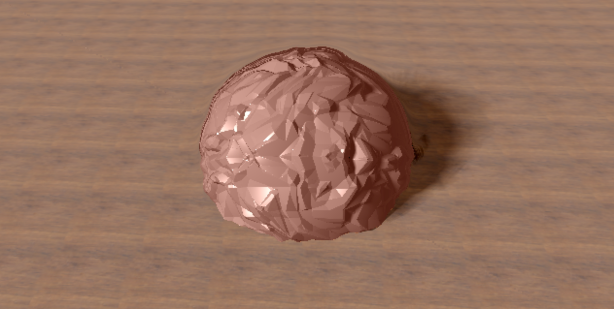

## Prologue
Up until this point, we haven't used the full potential of GPUs because most of the scenes and effects we rendered were on the CPU side. GPUs are powerful, especially when handling extensive calculations that can be performed in parallel.

In this lab, we will learn a 3D-rendering technique that can be completely implemented on the GPU (except for passing uniform values from the CPU), called ray marching. We will also implement some cool effects that are easier to implement with ray marching than ray tracing.

> Note: Of the last three labs, you will only need to complete two by December 6th (but you can choose to do 3). You can get them checked off at any point between now and December 6th.

## Intro
First, how is ray marching is different from ray tracing? To render a primitive with **ray tracing**, we need a function that, given an object and input ray, tells you exactly where that ray hits the object. A scene is usually described by a set of triangle meshes or by a set of primitives (primitives that you have implicit functions for). Using some spatial acceleration structure, we can quickly solve for the exact intersections between the rays and the objects.

However, with **ray marching**, we don't use a ray-object intersection solver. In ray marching, we allow for some leeway in the intersection, and accept it when a ray is close enough to any geometry. The intersection point is retrieved by starting at the eye location (the origin of the ray), and moving (or marching) along the ray in small steps. At each step we check whether or not a surface is within a given distance of the current location. We can set a limit on the number of march steps to prevent from marching into oblivion.

## Getting Started
The ShaderToy support code is located at https://www.shadertoy.com/view/4tKGzR.

**We highly recommend you create your own Shadertoy account before you start this lab**. If you do not, your progress will not be saved when you close the site. After creating your account, create a new shader (click the new button) and copy the stencil code to your shader. Remember to save your work frequently.

## Shadertoy
Before we implement this lab, we need to know how to use Shadertoy.
* In Shadertoy we only implement the fragment shader, each fragment representing part of the screen. This rendering technique is also known as screen space rendering, and is accomplished by drawing a quad the size of the screen on the application side. The vertex shader is hidden from users since it does nothing special (it handles only the one quad).
* You can modify code in Shadertoy with the text box on the right hand side of the screen. To update execution, click the “Compile” (arrow) button on the bottom left of the code.

* Remember that we need to use uniform values in GLSL shaders to store parameters passed from CPU code. However, Shadertoy’s API has already taken care of that for us. There are some built-in uniform values that we can use directly in Shadertoy. You can click “Shader Inputs” at the top of the shader editor to check out details.
* The `mainImage()` function in Shadertoy is the equivalent of `main()` in common GLSL fragment shaders. The `mainImage()` function uses two parameters:
    - `out vec4 fragColor` : Final color of the current pixel, identical to `gl_FragColor`
    - `in vec2 fragCoord` : Same as `gl_FragCoord`

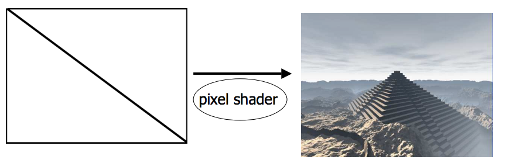

Rendering with a full-screen quad

## Constructing the Ray
Imagine you and your monitor are placed in a virtual world. Your eyes look at a rectangle (your monitor), which we will call an image plane. Let’s say the image plane has a position and orientation in the virtual world space. Recall that we want the center of the image plane placed at (0, 0) before translating to world space. To do that, we scale the screen by its resolution (from x in the range [0, width] and y in the range [0, height] to x, y in the range [0, 1]) and then center the image plane at (0, 0) (from x, y in the range [0, 1] to x, y in the range [-1, 1]).

After translations, the x, y points on this rectangle are points in uv coordinates. To preserve the correct display ratio, we scale the width, and thus the u direction by **screenwidth/screenheight**. We also need a transformation matrix to transform a point from image plane to virtual world space. The difference is how ray marching achieves the perspective effect compared to ray tracing.

In ray marching, all we need is a single number to simulate the perspective effect rather than constructing a complex perspective matrix in traditional ray tracing. The distance between the eye and the image plane is analogous to the focal length of a camera lens and focal point. (See the figure below.) Changing the focal length does not change the behaviour of the rays, only what direction we cast them!

### Task 1:
In the `mainImage()` function, construct the ray direction vector.
* Construct uv-coordinates based on `fragCoord` and screen resolution. (You can get the screen resolution using the built-in variable `iResolution`.)
* Center the screen at the origin (0, 0) by converting uv from [0, 1] to [-1, 1].  
* Scale `uv.x` by screenwidth/screenheight to preserve correct display ratio.
* Modify `rayDirection` to contain uv as the xy coordinates, and `focalLength` as the z coordinate.
* Each of the components of `rayDirection` designates the relative length of directions in our camera system. (The uv directions span the image plane while `focalLength` is the direction into the image plane.) Multiply the camera vectors with the components of `rayDirection` and sum your results to get the world-space `rayDirection`.
* Normalize `rayDirection`.

  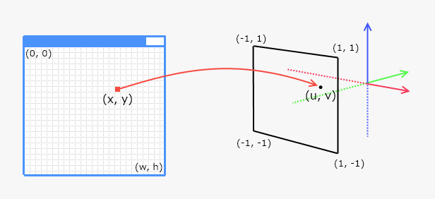
  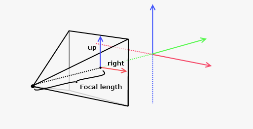

From left to right (1): Transform (x, y) from (w, h) to (-1, 1)
(2): Transforming image plane vector to actual ray direction in world space

## March Our Ray
Now that we’ve got our ray in world space, we can move on to implementing the ray marching algorithm. First, let’s dive into the algorithm.

### Iteration Count
The iteration count is the maximum number of march steps that we allow the raymarch loop to execute before bailing out or hitting a surface.

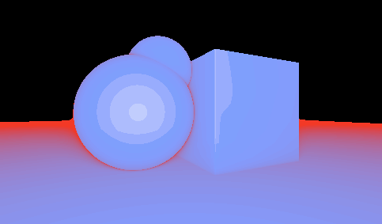

Iteration-based coloring. The pixel color is determined by the number of march steps.

### Bounding Distance
We can accelerate the ray marching algorithm if we stop marching after a specified distance. As discussed before, at each step we calculate the distance to the closest surface and march along the ray direction by this amount. The sum of the distances represents how far the ray has marched at each step. By using a bounding distance, we can drop a ray as soon as the distance traveled exceeds the limit. Otherwise, the loop is bounded only by iteration count.

### Threshold
We need to define a threshold value that can determine whether or not there is an intersection with any geometry surfaces. For instance, we consider there to be a ray-surface intersection if, at a step during marching, we notice that the distance to the closest surface is less than the threshold value. The threshold is usually small, around 0.0001 to 0.001.

We’ve provided a type named `PrimitiveDist`. This struct contains a distance from the scene and a primitive identifier. The options for the primitive are `SPHERE`, `PLANE`, and `NO_INTERSECT`.

### Task 2:
* In `raymarch()`, set the upper bound in the for loop (i.e. the iteration count) to be 1000, bounding distance to 50.0 and threshold value to 0.001.
* In each iteration, calculate our current world space position along the ray using ro and rd (ray origin and ray direction), and get the closest distance to the geometry from the `map()` function.
* March your ray forward by adding a proportion (~0.1) of the distance from `map()` to marchDist. We use a proportion of the returned distance to march more quickly through wide open spaces, and less quickly when objects are nearby. This renders more quickly than marching by a constant distance at each step, and reduces visual artifacts that appear from rays passing, or “tunneling”, through a surface rather than hitting it.
* Exit the raymarch loop if:
    - (1) The distance from `map()` is less than the threshold value -> Intersection
    - (2) `marchDist` exceeds the bounding distance -> No intersection
* If we found an intersection then return a `PrimitiveDist` containing marchDist and the primitive from map(). Otherwise, return -1.0 and `NO_INTERSECT`.

## Representing Geometry with a Distance Map
In ray marching, the geometry is defined by a distance map. A distance map is a function that takes a point (for us, in world space) and returns the closest distance to the scene’s geometry.

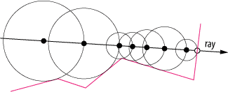

Distance function returns the closest distance among all objects to the current point

The distance map function defines the geometry of our scene. In this lab, our scene only contains a sphere and a plane. We’ve already provided you the signed distance function for both sphere and plane. All you have to do is to determine which one is closer to a given world space point p.

> Our distance functions are signed to account for overstepping. If we step a little bit past the intersection, the sign should be negative. Adding the distance function’s result to our current raymarch distance will decrease the distance and correct our result.

### Task 3:
* Return a `PrimitiveDist` containing the minimum of `sdFloor()` and `sdTwistedSphere()` and the closer primitive.

**You should be able to see something in your scene right now.** It probably looks like a white circle moving across a grey background. This is because the surface normal is not accurate. Let’s fix it.

## Render the Result
The way that surface normals are calculated in ray marching is different from ray tracing. In ray marching, our distance map is a special type of function known as scalar field since it assigns to each point (x, y, z) a scalar value. Knowing this, we can compute the surface normal using a vector known as the gradient. If we have a scalar field f, the gradient is defined as:

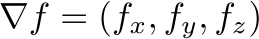

We can show that the gradient is perpendicular to the surface S implicitly defined by `map(p) = 0`. Informally: the gradient points in the direction of maximum change in f. Moving along a tangent plane of S around p will keep f close to 0. So ∇f should have minimal tangent component. That is, it should be perpendicular to S.

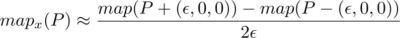

Here, ε (epsilon) is a small number.

### Task 4:
Next, we need to fill in `calcNormal()`. Calculate the x component of the normal vector at p with the following formula:

`map(position + vec3(epsilon, 0.0, 0.0)).dist - map(position - vec3(epsilon, 0.0, 0.0)).dist;`

Using a handy GLSL feature called [swizzling](https://www.khronos.org/opengl/wiki/Data_Type_(GLSL)#Swizzling), this can be more cleanly written as

`map(position + e.xyy).dist - map(position - e.xyy).dist`

* Do the same for each of the x, y, and z components. The difference for each component is where epsilon is placed in the vec3.
* Normalize the vector.

Now you should see a grey sphere on a gray plane. This is a bit boring. We want to render different objects with different colors. In order to do that, you need to know which object the ray is intersecting with.

### Task 5:
In `render()`, look at how we assign different materials to different primitives. Make things colorful by selecting the Channels at the bottom of the editor and clicking on a Texture! You have to click on the texture, then close the window before the texture is registered. (Note that `texCube()` is empty and will be filled in in the next part, so no textures will be visible yet)

## Triplanar Texture Mapping
One of the problems with applying textures with just uvs is that it ignores issues of dimension, causing stretching. Triplanar texture mapping solves this problem, which is especially useful when it comes to terrain or displaced surfaces (which we’ll implement later).

  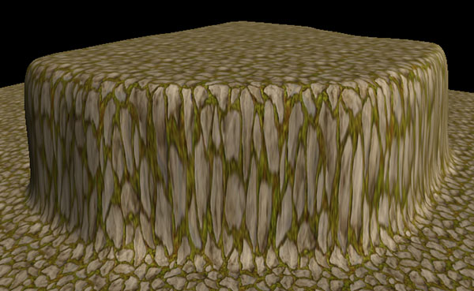
  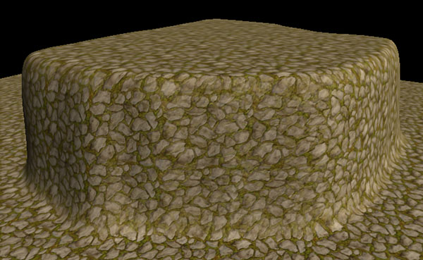

Left: Terrain with normal texture mapping, Right: Terrain with Triplanar texture mapping

Here’s how this works: we texture the geometry three times, once in each direction (x, y, z) and blend the result. Given a point, we could texture it in three different ways - one for each axis. All of these ignore one coordinate, as mentioned earlier. However, the extent of distortion depends on the angle between the axis in question and the surface around the point. This is decided by the normal. Hence all we need to do is weigh the different texture projections by the normal. Since our normals are… well, normalized, we can literally multiply each projection by the normal coordinate in question, sum these values, and get our result.

### Task 6:
* In the `texcube()` function, sample x, y, and z projections passing the sampler and p.yz, p.xz, and p.xy into the texture() function.
* Interpolate the x,y,z we just sampled in the above steps based on the normal. (Make sure when interpolating that all three factors of the normal are non-negative. You can ensure this by calling, for example, `abs(normal.x))`
* Pseudocode:

    `x = sample(texture, point.yz);`
    
    `y = sample(texture, point.xz);`

    `z = sample(texture, point.xy);`
    
    `return interpolate(x,y,z,normal);`

This should give you a nice-looking result.

## The Power of Distance Fields
Distance fields are convenient because they provide global information with little overhead. In a standard rasterizer, you have to do a lot of work to get global data (for shadows or lighting or noise and so on). In a ray tracing pipeline, you have to build your spatial acceleration data structures and cast rays into the world, which is slow and cumbersome. However, with distance fields, you can query information about the geometry of the entire scene with just one fast function call.

This means that several realistic shading techniques are made easy to implement with distance fields. Raymarching makes these techniques even more accessible! We’re going to explore these properties of distance fields to render surface displacements and soft shadows with penumbra when doing ray marching based rendering. (If you’re more adventurous, you can mess with distorting shapes too by multiplying the distance map with math functions/noise. The limits are endless!)

  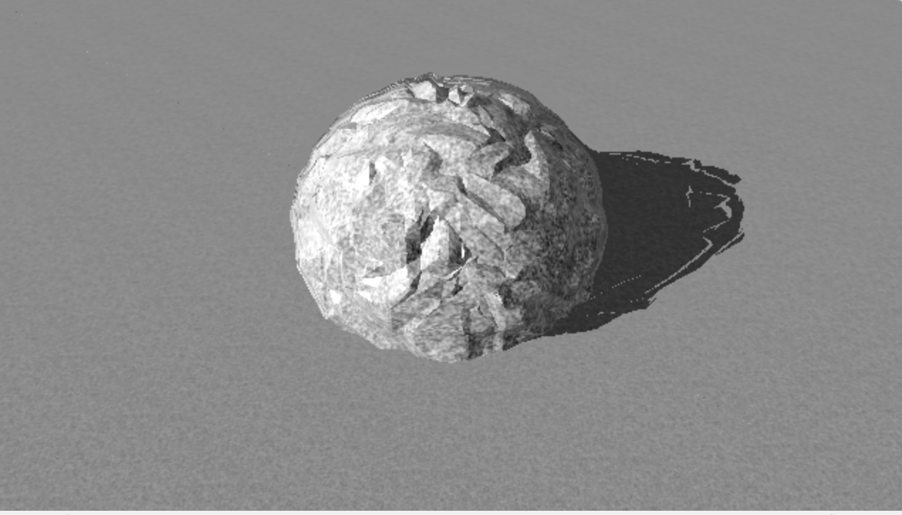
  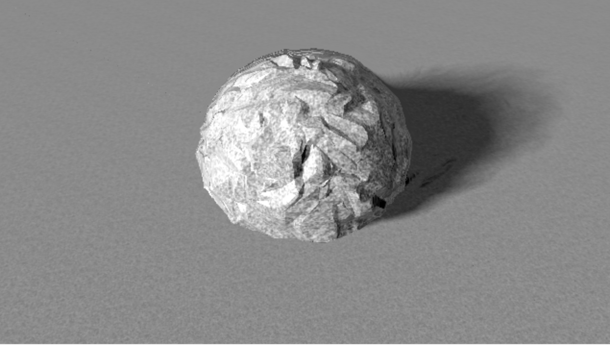

Left: Hard shadow, Right: Soft shadow

In our support code, we gave you a shadow routine. This routine computes hard shadows, where either a point is in shadow or it is not. (It’s much like Ray, except computed using ray marching instead of tracing.) As you can see above, this looks unnatural compared to soft shadows. This makes sense - point lights don’t exist in reality, so the light distribution emanates from various points and angles. Objects rarely occlude light entirely.

How would we represent partial occlusion of light? Inigo Quilez, a whiz at GLSL and founder of Shadertoy, came up with the following approximation for soft shadows:
http://www.iquilezles.org/www/articles/rmshadows/rmshadows.htm

**darkness = min(darkness, k \* h / t)**

>  In the end this is a hack. Our light is defined by a point, and we’re trying to treat it as an area light. Despite our various adjustments, this model won’t be sufficient for physically accurate rendering.

Where k (5.0 - 10.0) is a constant that determines the hardness of shadow edges, h is what we get from the distance field, and t is how far we’ve traveled along the ray.

To come up with this approximation, visualize an area light, a partially occluding object, and a shadowed point. The distance from the ray to the object and the distance from the shadowed point to the object both (in)versely correlated with the size of the shadow. Conveniently, we have both pieces of information: the first from `map()`, and the second from `marchDist`.

### Task 7:
* Based on the soft shadow equation, modify shadow() to apply soft shadow effect to your scene.

Now the shadow is smoothed around the edge and looks much better!

## Adding Displacement
The last thing we want to implement is displacement mapping, which refers to the actual displacement of points along the sphere - as opposed to normal or bump mapping.

  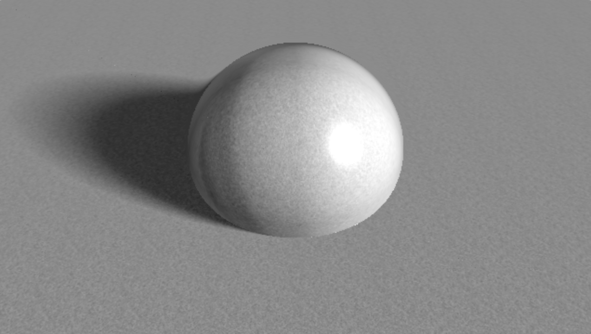
  

Left: Sphere without displacement mapping, Right: Sphere with displacement mapping

Displacement mapping is much easier to implement in ray marching as compared to ray tracing. All we need to do is to construct a displacement map and simply add the displacement to the original distance field. The displacement map can be anything, a simple math function or a complex noise map.

  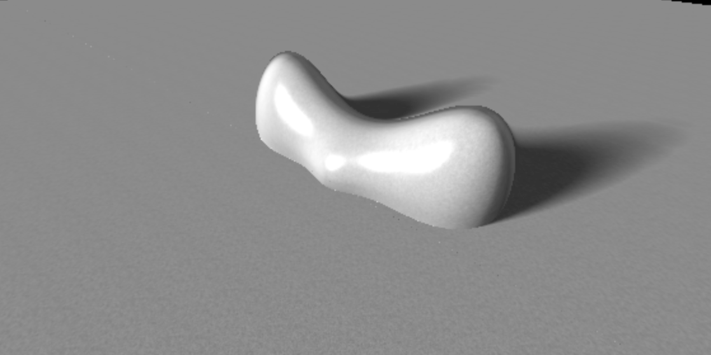
  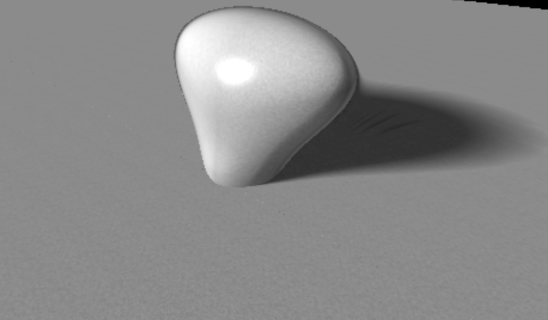

  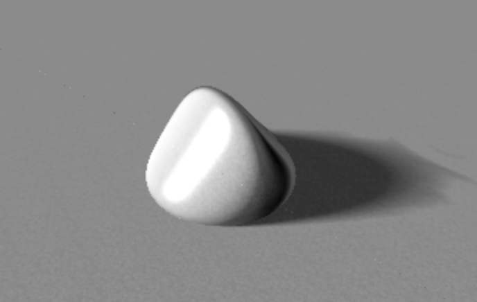
  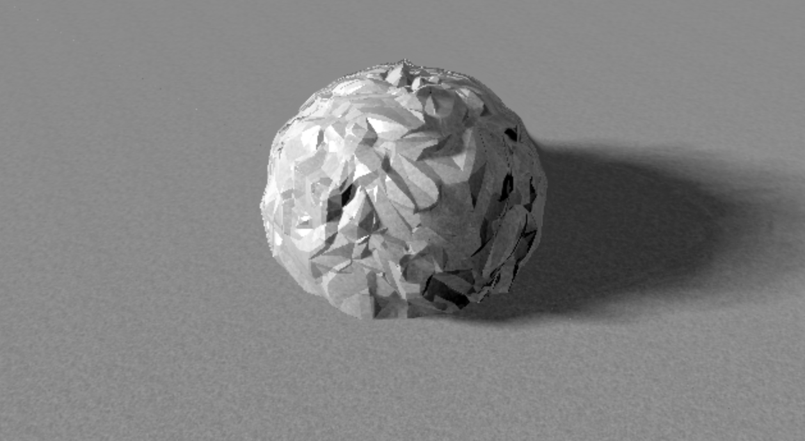

Top-Left: sin(p.x) + cos(p.z) Top Right: sin(p.x) + cos(p.y)
Bottom-Left: sin(p.x * p.y)^2 Bottom-Right: Triangle-noise

The shapes above are constructed from a sphere by adding different displacement functions.

### Task 8:
Build your own displacement function inside `calculateDisplacement()`. The parameter this function takes is where you’re currently at in world space. This function should return something small (between -1 and 1).
* For guidance, check out the above pictures and their captions. We have also left you a sample displacement map in the function `tri3()`, which is a triangle noise map.
* One option is to sample from a noise texture (which you can access from the channels at the bottom of the code box). Another is to make a noise function using a combination of sin, cos, abs, floor, ceil, and other math functions.

You now have a lovely shape in your browser, well done! We hope this lab gave you some intuition on how ray marching works and how it is different from ray tracing.

## End
Now you are ready to show your program to a TA to get checked off!

Be prepared to answer one or more of the following:
* How does raymarching differ from raytracing?
* What sorts of flexibility does using a signed distance field have over traditional ray-object intersection tests?
* Why is the distance field signed?

### Food for thought
Inigo Quilez has created several demos (almost all raymarched!) on Shadertoy, which you can use as inspiration for your final project:
https://www.shadertoy.com/user/iq
