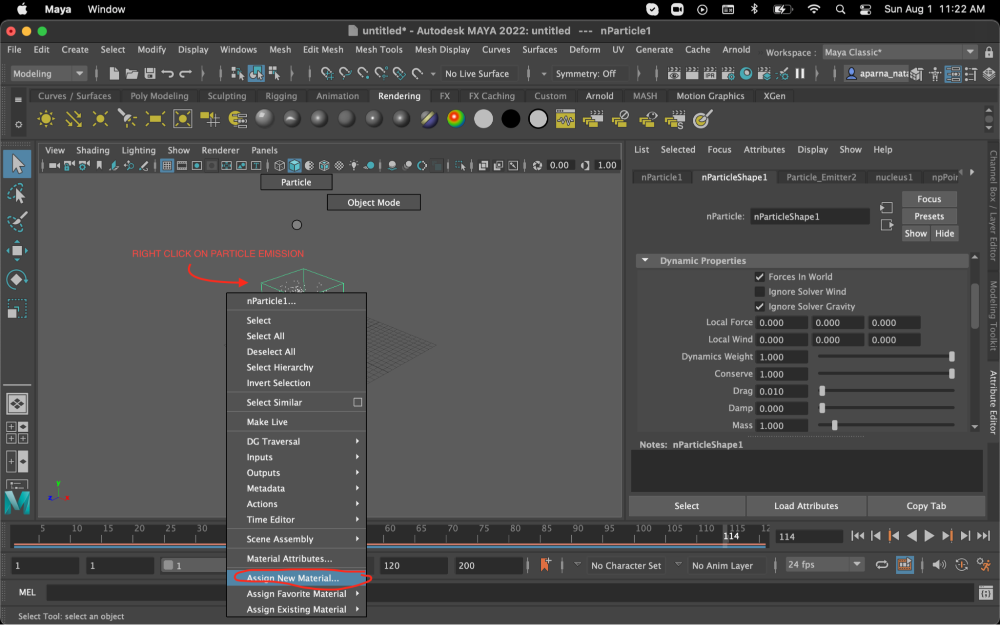
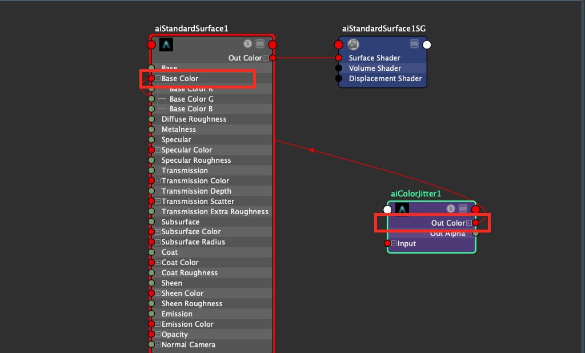
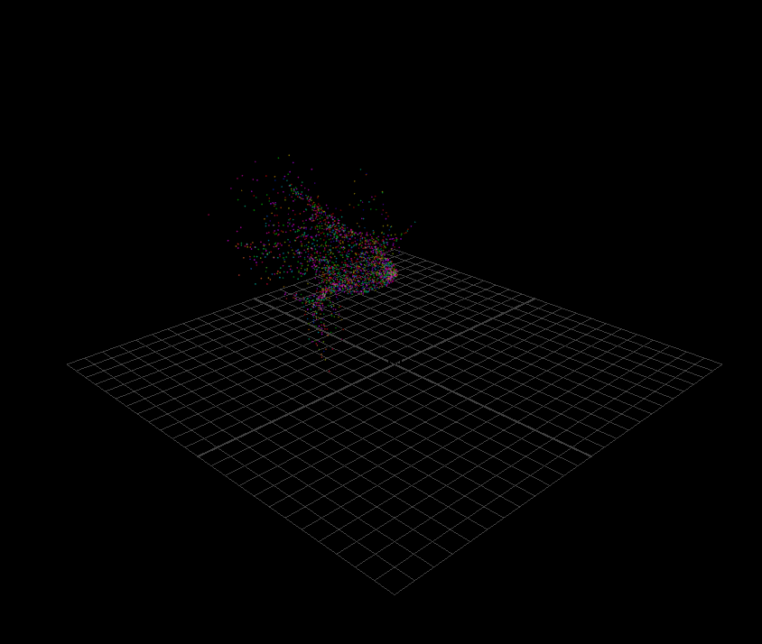

# Lab 9: Particles


## Prologue

At this point, you've learned the basic foundations of OpenGL and
Maya! In this lab you will create and shade your own particle system through one of two options. By using your knowledge of...

1. Framebuffers
2. Maya

Note: Of the last three labs, which will be helpful for
your final project, you will only need to complete two by November 30th
(but you can choose to do 3). You can get them checked off
at any point between now and November 30th.

## Intro

Particles are often used in computer graphics because they're easy to
implement, look great, and can give you lots of cool effects like fire
and smoke. Particles can be implemented in many ways. In this lab we
will explore how to implement them using either framebuffers or Maya's features. You will only need to
complete the FBO Version or the Maya version of this lab, but feel free
to do both if you desire!

# Particles: FBO Version

## Introduction

A common strategy to implement particle emission, is to keep a list of
particle positions and velocities on the CPU, update them one at
a time, and then send their positions to the GPU to draw them.
But we know better.

Imagine a texture with RGBA float (positive and negative) texels. What
if we treated each texel as a particle? More precisely, each texel
represents one particle's XYZ position and its lifetime in seconds. In a
second texture, we can have the matching RGBA texel store XYZ velocity
and age in seconds. If we run a shader on an FBO with these two textures
as color attachments, we can update each particle in parallel!

We will tackle this in a few steps:

-   The first update initializes the particles' positions and
    velocities.
-   Subsequent passes update the positions and velocities or reset them
    if the particle has died (its age is greater than its
    lifetime).
-   The first draw pass takes the information in one FBO, updates each
    pixel, and places the new information in the other FBO.
-   The second draw pass draws one triangle for each particle and, in
    the shader, moves the triangles to the position stored in the
    texture.
    
## Getting Started

The support code is the same as lab7 and this lab builds off of that
code. Be sure to finish lab7 before starting lab8. The tasks start at 13
for continuity with inline comments. Open up `glwidget.cpp` to get
started.

Note that there is also a demo version of the lab that can be run by
inputting `/course/cs1230/bin/cs1230_lab07_demo` into
your terminal on the department machine through FastX3. Be sure to
toggle the "Particles" radio button.

## Particle Storm Clouds Brewing

As with most labs, there is a bit of an overhead to getting something
to show up on screen so let's get that set up. Make sure to go through
each task carefully.

### Task 13:

First, we are going to make the FBO member variables. Recall we are
using one for positions and one for velocities so we will need to make
two different FBOs. Let's start with `initializeGL()`, and initialize
`m_particlesFBO1` and `m_particlesFBO2` using
`std::make_shared<FBO>(...)`

-   They need 2 color attachments (position and velocity) but do not
    need depth attachments since it doesn't matter for the purposes of
    this lab.
-   For width and height, pass in `m_numParticles` and `1`.
-   For wrap method, filter method, and storage type we will use
    `TextureParameters::WRAP_METHOD::CLAMP_TO_EDGE`,
    `TextureParameters::FILTER_METHOD::NEAREST`, and `GL_FLOAT`.

### Task 14:

Great! Now to update the particles. You can see we already set up some
of the logic for you in `drawParticles()`. `prevFBO` will hold the last
particle state. We will update the particles from there and draw them to
`nextFBO`.

-   In `drawParticles()`, bind `nextFBO`
-   Note: we don't need to call `glClear` here because we know we're
    going to be overwriting all the pixels we care about.
-   Use the program `m_particleUpdateProgram`
-   Setup the textures to read from. We have two textures, so we need
    to tell which texture to put where:
    -   Call `glActiveTexture` with `GL_TEXTURE0`.
    -   Bind `prevFBO->getColorAttachment(0)`.
    -   Call `glActiveTexture` with `GL_TEXTURE1`.
    -   Bind `prevFBO->getColorAttachment(1)`.

-   Send the uniforms to our shaders using
    `glUniform***`. We will use the following
    uniforms:
    -   A `float` for whether or not it's the first
        pass, as GLSL doesn't support bools (pass in `firstPass`)
    -   An `int` for the number of particles
        (`m_numParticles`)
    -   Two textures, `prevPos` and `prevVel`. These are sent as
        `ints`. Send `0` for `prevPos` and `1` for `prevVel`,
        representing the active texture bindings we used for them.

-   Draw a fullscreen quad using `m_quad`. Note: this will not draw to
    the size of the whole screen, but instead to the size of our FBO
    because of the `glViewport` call in `FBO::bind()`. This means that our
    shader will operate on each particle, as we wanted.

### Task 15:

Let's fill in our update shader now. Most of it is provided. We just
need to fill in the update functions and the output locations. Let's
start with telling `particles_update.frag` which color attachments it
should output. At the top of `particles_update.frag`, declare the outputs,
`pos` and `vel`, with explicit locations. `pos` should have location `0` and `vel`
should have location `1`, because those are the color attachments we are
using for them. Both are `vec4`s. To declare an explicit location for a
uniform, you do something like this:
-   `layout(location = <desired location>) out <output type> <output name>;`

### Task 16:

These texture attachments are not going to update themselves so let's
fill that out. Remember that the xyz component represent the physics
portion of an individual particle, whether it is position or velocity.
The w component of position and velocity will determine the particle's
lifetime and its age respectively.  In the same file:

-   Fill in `updatePosition` by sampling `prevPos` and `prevVel` at `uv` and
    calculating `pos + vel * dt`. The `w` component shouldn't change from
    `prevPos`, as it is the lifetime. This is the set amount of time the
    particle will show on the screen and is therefore constant.
-   Fill in `updateVelocity` by sampling `prevVel` at `uv` and calculating
    `vel + gravity * dt`. The `w` component should increase by `dt`, as it is
    the age.

### Task 17:

Great! Now we'll draw the particles to the screen. Back in
`GLWidget::drawParticles`:

-   Unbind `nextFBO` so we're drawing to the default framebuffer
-   Clear the `color` and `depth` buffers
-   Use the program `m_particleDrawProgram`
-   Call `setParticleViewport()`. This is a helper function that we
    provided that will center the viewport around {0,0} with an aspect
    ratio of 1:1 so the particles aren't distorted.
-   Similar to before, set up our textures to read from:
    -   `glActiveTexture` with `GL_TEXTURE0`
    -   Bind `nextFBO->getColorAttachment(0)`
    -   `glActiveTexture` with `GL_TEXTURE1`
    -   Bind `nextFBO->getColorAttachment(1)`

-   Set up the uniforms
    -   An `int`, `0`, for `pos`, because it's
        `GL_TEXTURE0`
    -   An `int`, `1`, for `vel`, because it's
        `GL_TEXTURE1`
    -   An `int`, `m_numParticles`, for `numParticles`

-   Draw one triangle for each particle.  To do this, we need a VAO,
    but it doesn't need any associated data or state, so we've prepared
    a simple one for you.
    -   Call `glBindVertexArray` with `m_particlesVAO`
    -   Using `glDrawArrays`, draw `3 * m_numParticles` vertices using
        `GL_TRIANGLES`
    -   Unbind the VAO

-   Set the active texture back to `GL_TEXTURE0`

It's Raining Particles

Nice, almost there! We just need to fill in the `particles_draw` shaders!
But wait, we don't have any vertex data, we just know where the centers
of the particles should be. Luckily, we don't need to know the vertex
locations; we can just generate them in the vertex shader. Here are some
diagrams to explain what we're going to do:


### Task 18:

In `particles_draw.vert`:

-   Fill in `TRI_VERTS`. These are our triangle offsets. See the diagram
    above.
    -   We want to choose the offsets so that we can also use them as `uv`
        coordinates.
    -   The `pos` is the "anchor" point -- our particles position. We want the
        `uv` coordinate to be such that the square has texture coordinates
        going from 0 to 1 in both directions ({0,0} at `pos`). This can be
        seen by the blue square. Based on the diagram, figure out the XY
        values for `p1`, `p2`, and `p3`, and fill in `TRI_VERTS` accordingly.

-   Calculate `particleID` (the index of the particle we are on) and
    `triID` (the vertex of the current triangle that we are on). OpenGL
    provides an input called `gl_VertexID`. This tells us what vertex the
    shader is on, ranging from `0` to `3 * numParticles`.
    -   `particleID = gl_VertexID / 3` (floored)
    -   `triID = gl_VertexID % 3` (remainder of `gl_VertexID / 3`)

-   Sample `pos` and `vel` to get `posTime` and `velAge`.  You can do this
    using texture if you calculate the uv coordinates yourself, or you
    can use `texelFetch`, like this:
    -   `texelFetch(<texture>, ivec2(particleID,0), 0)`

When you run your program now and switch to the "Particle" window, you
should see white triangles flying everywhere.


If the particles aren't moving correctly or nothing is drawing, check
the output in Qt Creator for shader compilation errors or FBO errors. If
that didn't help, check that you used the correct
`glUniform***` calls, especially
`glUniform1f` vs `glUniform1i`. If
you send an integer to the GPU saying it is a float, the GPU will
interpret the bits as a float. This could cause some uniforms in your
shader to have junk values. Otherwise, you might need to go back and
check that you followed the steps correctly.

### Task 19

Once you have that working, there's just one last problem. Why are the
particles white triangles? We want nice colorful circles instead. In
`particles_draw.frag`, we don't want to color the fragments if our texture
coordinates are outside of a unit circle centered at {0.5, 0.5}. This is
why we did that complicated triangle offset earlier. We have provided
you with the method `pickRainbowColor()` that sends out a `vec3` color you
can use.

-   If the uv coordinate is within the unit circle (`length(uv - 0.5) <
    0.5`), color it using the input `color` with an alpha of 1.
    Otherwise, call `discard`. `discard` tells the shader to not color
    this fragment.

You're done! Congratulations! We skipped over a few of steps there, but
you should have a general sense of the idea behind GPU particles. We
encourage you to reuse the classes you filled in today for your final
project or any other project you want.


Now you are ready to show your program to a TA to get checked
off!

Be prepared to answer one or more of the following:

-   Why is the width and height for the FBOs `m_numParticles` and `1`
    respectively?
-   Why is the `nextFBO` bound when the `prevFBO`'s texture attachments are
    the ones being activated?
-   We didn't use the depth attachment for this lab, but can you think
    of a situation where you may want to use it?

Food for thought

There's plenty of other cool tricks you can do if you want. None of
these are required for this lab:

-   Color particles differently. We used a rainbow gradient, but you
    could do whatever! You could even properly texture map your
    particles using the uv coordinates (that's why we made them go from
    0 to 1 in that square around the particle).
-   Change particle radius dynamically. We made the particle grow when
    they are born and shrink when they die, but there's plenty more you
    could do!
-   Have more interesting update methods. You can add additional forces
    to make more complicated behavior, or update the particles to move
    along a specific curve.
-   Store particles in a 2D array instead of a 1D array. This would
    allow you to add more particles, as a 1 dimensional texture isn't
    very optimal. OpenGL has a limit on render buffer dimension that
    will vary from machine to machine. It is usually somewhere between
    8000 and 17000. This means that, using our current method of 1D
    indexing, you can only support that many particles. With 2D
    indexing, the number of particles you could store would be squared,
    allowing you to store millions of particles instead of our preset
    5000!
-   Draw particles in world space instead of screen space. In this lab,
    we drew our particles in the space from -1 to 1 in each dimension.
    In fact, our particles all had a z position of 0, so they were
    basically 2D particles. To draw 3D particles, you would instead need
    to transform the particle triangles from world space to screen
    space. This is slightly more complicated, because you would also
    need to handle billboarding, or making the particles all face the
    camera to give the illusion of spherical particles.

Check out some of these examples:

-   [https://threejs.org/examples/?q=particle\#webgl_gpu_particle_system](https://www.google.com/url?q=https://threejs.org/examples/?q%3Dparticle%23webgl_gpu_particle_system&sa=D&source=editors&ust=1630507972544000&usg=AOvVaw3DAjD1MyqdJAQl63y7wkwN)
-   [https://lab.hakim.se/trail/02/](https://www.google.com/url?q=https://lab.hakim.se/trail/02/&sa=D&source=editors&ust=1630507972545000&usg=AOvVaw1m7LRCnC77WvwWc8F2gKa-)
-   [https://www.youtube.com/watch?v=CMVRILPTWzU](https://www.google.com/url?q=https://www.youtube.com/watch?v%3DCMVRILPTWzU&sa=D&source=editors&ust=1630507972545000&usg=AOvVaw2okLwp0HuENJ8ihs-tMF11)

# Particles: Maya Version

In the Introduction to Maya lab we explored how to use Autodesk Maya (often shortened to just “Maya”). Maya is a 3D graphics simulation app that is the industry standard for creating impressive 3D animations - from video games to Marvel movies! It also has a python (and MEL- Maya Embedded Language) scripting API which allows you to create complex scenes and effects with a few lines of code. One basic feature we will explore allows you to simulate particles being emitted from some source. This is the basis for interesting 3D effects like snow, fire and smoke. In this section of the lab, we will use Maya’s GUI to implement a colorful particle emitter, and then replicate the scene using python scripting. In the last part of the lab we will use our programming knowledge to create cool particle-based effects within Maya using a python script.


## Part 1: Creating a shaded particle emitter in Maya

### Task 1: Create a particle emitter

1.  In the FX tab in Maya, create an emitter. Maya has created
    "emitter" objects for you that you can create to model things like a
    stream of particles to simulate fireworks or explosions. To create
    one in the application you have to select the FX tab and then the
    circled "emitter" button.


2.  When you create the emitter, a properties tab should appear which
    will allow you to configure your particle emitter.


1.  Position your emitter at X=0; Y=5; Z=0


3.  Toggle the play button on, you should see a downward stream of
    particles


### Task 2: Manipulate Particle Direction

We will manipulate particle direction by disabling gravity and using an
external force field. To do this:

1.  Hit pause on the particle emitter mid-emission and select the
    particle stream. On the left half of your screen, navigate to the
    nParticleShape tab, and check ignore solver gravity. This should
    make your particles emit in every direction.


After disabling gravity:


2.  To create a force field, toggle your menu to FX


Navigate to Fields/Solvers and click on Turbulence


Confirm the default magnitude value of 15, and hit apply


Now when you hit play, the motion of your particles should change from
a uniform 360 degree emission, to emission in the direction of your
newly added force field


### Task 3: Shading

1.  First add a light to the scene:

    - Navigate back to the modeling menu and toggle the rendering
    tab

    

    - Add a directional light to the scene and configure its properties
        to face the particle emitter

    

2.  Configure the light for the arnold shader by navigating to the
    directionalLightShape tab, going to the arnold menu, and setting the
    exposure to 1 and angle to 10

    

    -  Add an arnold surface shader by right clicking on the particle
        emission and selecting 'Assign New Material'

    

    - In the material menu select aiStandardSurface in the Arnold Surface
        section

    

3.  Next let's navigate to the hypershade node editor


4.  In the node editor, select the aiStandardShader we just applied to
    our particles


5.  To bring the aiStandardSurface to the graph editor, right click on
    it in the materials menu and drag your mouse to the graph editor.
    When you release your mouse, the node should show up in the node
    editor.


6.  In the node creator menu, search for jitter, aiColorJitter should
    show up. Double click on it. This should add the color jitter node
    to the graph editor


7.  Connect the color jitter's out color to the aiStandardSurface's
    base color



8.  Navigate to the Material viewer on the right half of the screen.
    Set it up to preview arnold shader colors by selecting the arnold
    option on the first dropdown


9.  Toggle type to face


10. To randomize colors, change the input from grey to a different base
    color, set the hue min to -1 and hue max to +1, saturation min and
    max to 10.


11. Exit the hypershade menu
12. Switch your renderer to Arnold


13. Hit play on the arnold viewportrenderer. This should shade your
    scene with the hypershade parameters we set


One frame of the shaded scene:



## Part 2: Creating a particle emitter with a python script.

Now that we have manually created a colorful particle emitter, we will
replicate the same scene using python. A link to the maya python API is
here: [https://download.autodesk.com/us/maya/2009help/api/main.html](https://www.google.com/url?q=https://download.autodesk.com/us/maya/2009help/api/main.html&sa=D&source=editors&ust=1630507972554000&usg=AOvVaw0x8RCdlIuiojuM0kNyR9sp)

1.  Create a new scene
2.  Open the maya script editor
3.  Flip to the python tab
4.  Import the necessary maya scripting packages

```
`mport maya.cmds as cmds
from mtoa.cmds.arnoldRender import arnoldRender
```

5.  Create a particle emitter

```
cmds.emitter(pos=(0,5,0), type="omni", rate=500, n="emitter")
cmds.particle( n='emitted' )
particle_emitter = cmds.connectDynamic( 'emitted', em='emitter')
```

6.  Add turbulence forces to influence the motion of the particle

```
cmds.turbulence( n='turbulence', m=15.0)
cmds.connectDynamic(particle_emitter, f='turbulence')
```

7.  Add a directional light to the scene

```
light = cmds.directionalLight(rotation=(-45, -60, -80), position=(17, 16, 15), intensity=1.0, n='light')
```

8.  Configure the light for the Arnold shader

```
cmds.setAttr('light.aiExposure', 1)
cmds.setAttr('light.aiAngle', 10)
```

9.  Add an arnold surface shader for the particles

```
particleShader = cmds.shadingNode('aiStandardSurface', asShader=True)
cmds.select('emitted')
cmds.hyperShade(assign=particleShader)
```

10. Add color jittering to randomize particle color

```
colorJitter = cmds.shadingNode('aiColorJitter', asShader=True)
cmds.connectAttr( colorJitter+'.outColor', particleShader+'.baseColor', force=True)
```

11. Set the default color of the particles to aqua

`cmds.setAttr(colorJitter+".input", 0, 1, 1, type="double3")`

12. Set the color range to the entire spectrum

```
cmds.setAttr(colorJitter+".faceHueMin", 1)
cmds.setAttr(colorJitter+".faceHueMax", -1)
```

13. Set the saturation to max

```
cmds.setAttr(colorJitter+".faceSaturationMin", 10)
cmds.setAttr(colorJitter+".faceSaturationMin", 10)
```

14. Set the camera position to a good place to capture the scene

```
cmds.camera('persp', e=True, position=(1.5, 6, 4.5), rotation=(-17,375,0))
```

15. Hit play on the scene and scub to a timestamp
16. Enable the Arnold renderer and hit play!

## Part 3: Taking Advantage of Maya Scripting

So far we have created and shaded a single particle
emitter. To explore the benefits of maya scripting, please demonstrate a
scene with multiple particle emitters, possibly interacting with each
other. Our example includes multiple particle emitters moving around and
emitting particles when they come close to each other. You can fill in
the todos below to emulate the same scene or build your own!

```
import maya.cmds as cmds
import random
import math

## HELPER METHODS ##

def moveEmitters(emitters):
    for instanceResult in emitters:
        x = random.uniform(-10, 10)
        y = random.uniform(0, 20)
        z = random.uniform(-10, 10)

        cmds.move(x, y, z, instanceResult)


def createAndGetEmitters():
    emittersToReturn = []
    // TODO 1: Create 50 particle emitters using a for loop. Each particle emitter should have a unique name.
    //HINT 1: see the previous section on how to create and name a particle emitter via scripting (step 5)
    //HINT 2: to set the rate use this command e.g: cmds.setAttr("%s.rate" % emitter1[1], 300)


        emittersToReturn.append(particleEmitter)
    return emittersToReturn


def getDistance(emitter1, emitter2):
    diffX = cmds.getAttr("%s.translateX" % emitter1[0]) - cmds.getAttr("%s.translateX" % emitter2[0])
    diffY = cmds.getAttr("%s.translateY" % emitter1[0]) - cmds.getAttr("%s.translateY" % emitter2[0])
    diffZ = cmds.getAttr("%s.translateZ" % emitter1[0]) - cmds.getAttr("%s.translateZ" % emitter2[0])

    return math.sqrt((diffX * diffX) + (diffY * diffY) + (diffZ * diffZ))


def emitOnCloseContact(emitters):
    for emitter1 in emitters:
        for emitter2 in emitters:
            //TODO 2: if the distance between 2 emitters is less than 1, tell the emitters to emit particles, if not, tell them to not emit particles
            //Hint 1: Use the getDistance method provided to compute distance
            //Hint 2: Make sure you aren’t comparing the distance between the same emitter

## SCENE SETUP AND FRAME EXECUTION ##

emitters = createAndGetEmitters()

for frame in range(1, 5):
    cmds.currentTime(frame)
    moveEmitters(emitters)
    emitOnCloseContact(emitters)
